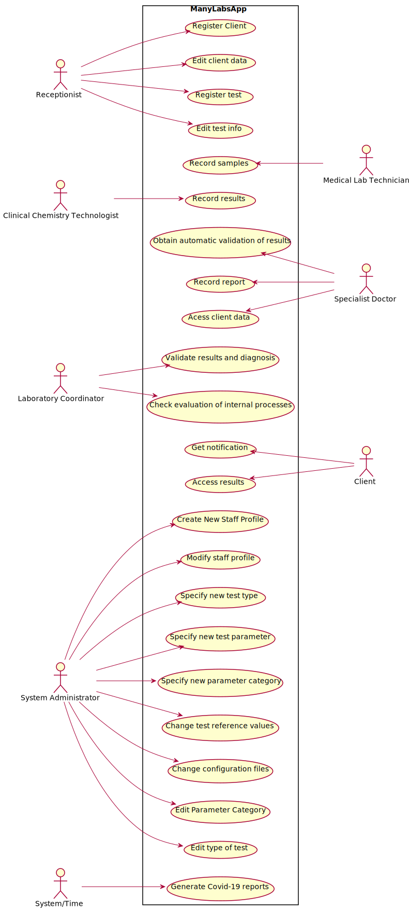

# Use Case Diagram (UCD)

**In the scope of this project, there is a direct relationship of _1 to 1_ between Use Cases (UC) and User Stories (US).**

However, be aware, this is a pedagogical simplification. On further projects and curricular units might also exist _1 to N **and/or** N to 1 relationships between US and UC.

**Insert below the Use Case Diagram in a SVG format**

**For each UC/US, it must be provided evidences of applying main activities of the software development process (requirements, analysis, design, tests and code). Gather those evidences on a separate file for each UC/US and set up a link as suggested below.**

# Use Cases / User Stories
| UC/US  | Description                                                            |  User Story Description                                              |
|:----|:------------------------------------------------------------------------| :----------------------------------------------------------------------|
| US1 | [Register New Client](US1.md)   |  As a receptionist of the laboratory, I intend to register a new client. |
| US2 | [Edit Client Data](US2.md)  |  As a receptionist of the laboratory, I intend to edit client data. |
| US3 | [Check/Edit Test Info](US3.md)|  As a receptionist of the laboratory, I intent to edit the info of a registered test. |
| US4 | [Register New Test](US4.md)|  As a receptionist of the laboratory, I intend to register a test to be performed to a registered client. |
| US5 | [Record Samples](US5.md)|  As a medical lab technician, I want to record the samples collected in the scope of a given test. |
| US6 | [Record Analysis Results](US6.md)|  As a Clinical Chemistry Technologist of the chemical laboratory, I want to record the results of the analysis of the samples. |
| US7 | [Record Report and Diagnosis](US7.md)|  As a specialist doctor of the chemical laboratory, I want to record the report of the results and diagnosis. |
| US8 | [Validate Results and Report](US8.md)|  As a laboratory coordinator, I want to validate the results and report. |
| US9 | [Specify New Type of Test](US9.md)|  As an administrator, I want to specify a new type of test and its collecting methods. |
| US10 | [Specify New Test Parameter](US10.md)|  As an administrator, I want to specify a new test parameter and categorize it. |
| US11 | [Specify New Parameter Category](US11.md)|  As an administrator, I want to specify a new parameter category. |
| US12 | [Edit Type Of Test](US12.md)|  As an administrator, I want to edit type of test. |
| US13 | [Edit Parameter Category](US13.md)|  As an administrator, I want to edit parameter category. |
| US14 | [Create New Staff Profile](US14.md)|  As an administrator, I want to create a new staff profile. |
| US15 | [Edit Staff Profile](US15.md)| As an administrator, I want to edit staff profile. |
| US16 | [Automatic Validation of the Analysis Results](US16.md)| As a specialist doctor/system, I want to get an automatic validation of the analysis results using test reference values. |
| US17 | [Change Test Reference Values](US17.md)|  As an administrator, I want to change the test reference values for the automatic validation of the analysis results. |
| US18 | [Client Notification](US18.md)|  As a client, I want to receive a notification via SMS and email when results are available. |
| US19 | [Check Test Results](US19.md)|  As a client, I want to check the test results on the app. |
| US20 | [Check Clients' Results](US20.md)|  As an MLT/CCT/Specialist Doctor/Laboratory Coordinator, I want to check clients’ results. |
| US21 | [Report Covid-19 Data Automatically](US21.md)|  As a system, I want to report Covid-19 data automatically. |
| US22 | [Check Evaluation of Internal Processes](US22.md)|  As a Laboratory Coordinator, I want to check evaluation of internal processes. |
| US23 | [Change Configuration Files](US23.md)|  As an administrator, I want to change the configuration files. |
| ... | ...| ...|
