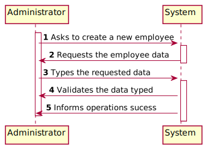
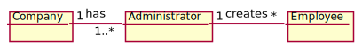
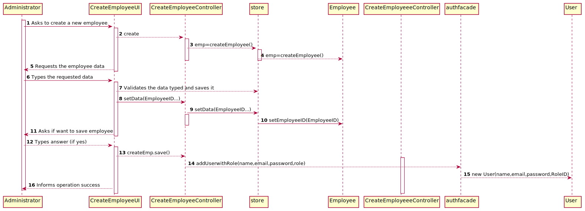
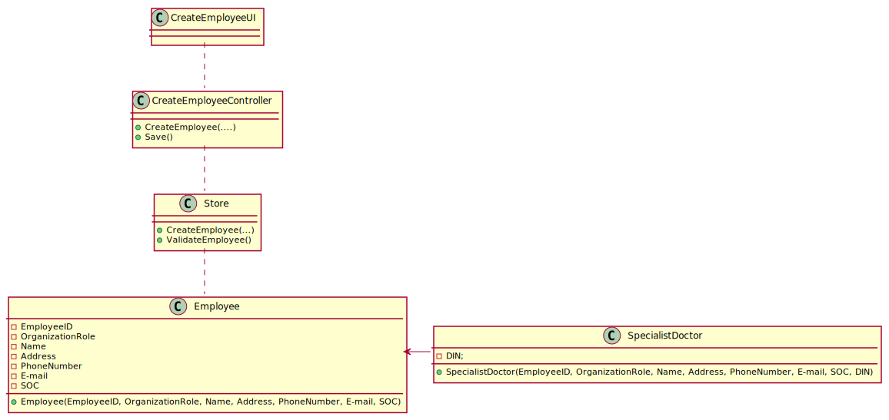

# US 007 - Register New Employee

## 1. Requirements Engineering

### 1.1. User Story Description

*As an administrator, I want to register a new employee.*

### 1.2. Customer Specifications and Clarifications 

From the client clarifications:
All the roles in the many Labs company are characterized by the following attributes:
-Employee ID; 
-Organization Role; 
-Name; 
-Address; 
-Phone Number; 
-E-Mail; 
-Standard Occupational Classification (SOC) code. 

### 1.3. Acceptance Criteria

Each user must have a single role defined in the system. The "auth" component available on the repository must be reused (without modifications).

### 1.4. Found out Dependencies

*Identify here any found out dependency to other US and/or requirements.*

### 1.5 Input and Output Data

*Identity here the data to be inputted by the system actor as well as the output data that the system have/needs to present in order to properly support the actor actions. Regarding the inputted data, it is suggested to distinguish between typed data and selected data (e.g. from a list)*

Input Data:
-Employee ID; 
-Organization Role; 
-Name; 
-Address; 
-Phone Number; 
-E-Mail; 
-Standard Occupational Classification (SOC) code.

Output Data:
-New employee
-Sucess in creating a new employee

### 1.6. System Sequence Diagram (SSD)

*Insert here a SSD depicting the envisioned Actor-System interactions and throughout which data is inputted and outputted to fulfill the requirement. All interactions must be numbered.*

### 1.7 Other Relevant Remarks

*Use this section to capture other relevant information that is related with this US such as (i) special requirements ; (ii) data and/or technology variations; (iii) how often this US is held.* 

## 2. OO Analysis

### 2.1. Relevant Domain Model Excerpt 
*In this section, it is suggested to present an excerpt of the domain model that is seen as relevant to fulfill this requirement.* 

### 2.2. Other Remarks

*Use this section to capture some aditional notes/remarks that must be taken into consideration into the design activity. In some case, it might be usefull to add other analysis artifacts (e.g. activity or state diagrams).* 

## 3. Design - User Story Realization 

### 3.1. Rationale

**The rationale grounds on the SSD interactions and the identified input/output data.**

| Interaction ID | Question: Which class is responsible for... | Answer  | Justification (with patterns)  |
|:-------------  |:--------------------- |:------------|:---------------------------- |
| Step 1 Asks to create a new employee		 |instantiating a new employee?| Company          | Creator:1/2                 |
| Step 2 Requests the employee data 		 |requesting the employee data?	|             |                     |
| Step 3 Types the requested data		 | typing the requested data?							 |             |                              |
| Step 4 Validates the data typed and saves it 		 |validating and saving the data|Company           |Information Expert        |
| Step 5 informs the operation success 		 |informing the user of the operation sucess						 |UI             |Information Expert                              |
            

### Systematization ##

According to the taken rationale, the conceptual classes promoted to software classes are: 

 * Administrator
 * Company

Other software classes (i.e. Pure Fabrication) identified: 
 * CreateEmployeeUI  
 * CreateEmployeeController

## 3.2. Sequence Diagram (SD)

*In this section, it is suggested to present an UML dynamic view stating the sequence of domain related software objects' interactions that allows to fulfill the requirement.* 

## 3.3. Class Diagram (CD)

*In this section, it is suggested to present an UML static view representing the main domain related software classes that are involved in fulfilling the requirement as well as and their relations, attributes and methods.*

# 4. Tests 
*In this section, it is suggested to systematize how the tests were designed to allow a correct measurement of requirements fulfilling.* 

**_DO NOT COPY ALL DEVELOPED TESTS HERE_**

**Test 1:** Check that it is not possible to create an instance of the Example class with null values. 

	@Test(expected = IllegalArgumentException.class)
		public void ensureNullIsNotAllowed() {
		Exemplo instance = new Exemplo(null, null);
	}
    
**Test 1:** Check if it is not possible to creante an instance of employee with an invalid email.

    Employee e2=new Employee("123", "J M V","Maia", "12345678901", "1234", "LABCORD",0);
        assertEquals(e2.isEmployeeValid(), false);
        
**Test 2:** Check if employee is valid

    private Employee e=new Employee(email,name,Address,PhoneNumber,SOC,"LABCORD",0);

    private  Employee e1=new Employee("123",name,Address,PhoneNumber,SOC,"LABCORD",0);

    assertEquals(e.isEmployeeValid(),true);
    assertEquals(e1.isEmployeeValid(), false);
    
**Test 3:** Test to see if getEmail is returning the expected value

    public void testGetEmail() {
        String expectedEmail="j@gmail.com";
        assertEquals(e.getEmail(),expectedEmail);
    }
    
**Test 4:** Test to see if DIN is valid
    
    
    String DIN1="-111111";
    String DINV="123456";
    SpecialistDoctor sd=new SpecialistDoctor("j@gmail.com","ju","maia","12345678901",
            "1234","SPECIALISTDOC",DINV,0);
    SpecialistDoctor sd1=new SpecialistDoctor("j@gmail.com","ju","maia","12345678901",
            "1234","SPECIALISTDOC",DIN1,0);
    public void testIsDINValid() {
        assertEquals(sd.isDINValid(),true);
        assertEquals(sd1.isDINValid(),false);

    }

*It is also recommended to organize this content by subsections.* 

# 5. Construction (Implementation)

*In this section, it is suggested to provide, if necessary, some evidence that the construction/implementation is in accordance with the previously carried out design. Furthermore, it is recommeded to mention/describe the existence of other relevant (e.g. configuration) files and highlight relevant commits.*

In this program the Admin calls to create a user with an UI that makes contact between the Controller and the Admin user. 
After the Admin saying that he want to create an User, he types the data, the Ui sends the data to the Controller, the Controller sends the data to the store, and the store sends the data for the class that will be responsible for constructing said instance.
After that UI will ask if he wants to save the employee, if Admin says yes it will be created a user that can log in with the data
sent previously. To create a user we use the authfacade() then we add an user with the role, name, email, and a generated password.

*It is also recommended to organize this content by subsections.* 

# 6. Integration and Demo 

*In this section, it is suggested to describe the efforts made to integrate this functionality with the other features of the system.*

To integrate this functionality in the system i had first to create an employee and store it, after creating the employee
the program is going to ask if the user wants to save it, if the user says yes it will be created a loggable user with the data from
employee

# 7. Observations

*In this section, it is suggested to present a critical perspective on the developed work, pointing, for example, to other alternatives and or future related work.*

