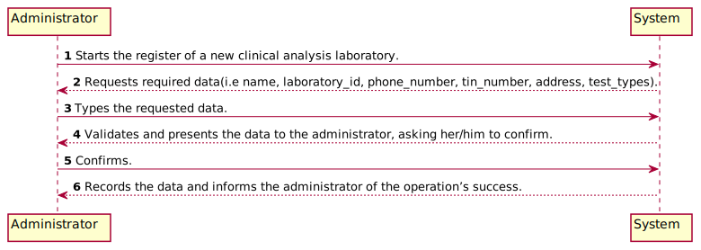

# US 008 - Register New Clinical Analysis Laboratory

## 1. Requirements Engineering

*In this section, it is suggested to capture the requirement description and specifications as provided by the client as well as any further clarification on it. It is also suggested to capture the requirements acceptance criteria and existing dependencies to other requirements. At last, identfy the involved input and output data and depicted an Actor-System interaction in order to fulfill the requirement.*

### 1.1. User Story Description

*As an administrator, I want to register a new clinical analysis laboratory stating which kind of test(st) it operates.*

### 1.2. Customer Specifications and Clarifications

From the client clarifications:
* Each Clinical Analysis Laboratory is characterized by the following attributes:
Laboratory ID;
Name;
Address;
Phone Number;
TIN number.

Each Receptionist and each Medical Lab Technician can work in any Clinical Analysis Laboratory of the Many Labs network.

### 1.3. Acceptance Criteria

* AC1: Administrator need to be logged in to register a new Clinical Analisys Laboratory

* AC2: Clinical Analysis Laboratory must have name, laboratoryID, phoneNumber, tinNumber, address, test_types. 

### 1.4. Found out Dependencies

*Identify here any found out dependency to other US and/or requirements.*

* User Story - 11
* User Story - 10
* To stating which kind of test(st) it operates, the Administrator must have created parameters and category to select which kind of test the clinical analysis laboratory will operates.

### 1.5 Input and Output Data

*Identity here the data to be inputted by the system actor as well as the output data that the system have/needs to present in order to properly support the actor actions. Regarding the inputted data, it is suggested to distinguish between typed data and selected data (e.g. from a list)*

1. The Administrator starts the register of a new clinical analysis laboratory.
2. The System requests required data(i.e name, laboratoryID, phoneNumber, tinNumber, address, test_types).
3. The Administrator types the requested data.
4. The system validates and presents the data to the administrator, asking her/him to confirm.
5. The Administrator confirms.
6. The system records the data and informs the administrator of the operation’s success.

### 1.6. System Sequence Diagram (SSD)

*Insert here a SSD depicting the envisioned Actor-System interactions and throughout which data is inputted and outputted to fulfill the requirement. All interactions must be numbered.*

### 1.7 Other Relevant Remarks

*Use this section to capture other relevant information that is related with this US such as (i) special requirements ; (ii) data and/or technology variations; (iii) how often this US is held.*

## 2. OO Analysis

### 2.1. Relevant Domain Model Excerpt
*In this section, it is suggested to present an excerpt of the domain model that is seen as relevant to fulfill this requirement.*

### 2.2. Other Remarks

*Use this section to capture some aditional notes/remarks that must be taken into consideration into the design activity. In some case, it might be usefull to add other analysis artifacts (e.g. activity or state diagrams).*

## 3. Design - User Story Realization

### 3.1. Rationale

**The rationale grounds on the SSD interactions and the identified input/output data.**

| Interaction ID | Question: Which class is responsible for... | Answer  | Justification (with patterns)  |
|:-------------  |:--------------------- |:------------|:---------------------------- |
| Step 1: register new clinical analysis laboratory|...instantiating a new Clinical Analysis Laboratory?|Administrator|Creator: R1/2 (?)|
| Step 2: request data(i.e name, laboratoryID, phoneNumber, tinNumber, address, test_types)|n/a|    |        |
| Step 3: types requested data 		 |...saving the input data?	 |Clinical Analysis Laboratory | I.E the object created in step 1 has its own data|                |
| Step 4: validate and shows the data and requests confirmation |...validate that the data? | Company | I.E was entered correctly, with no duplicates or blanks | knows all the data
| Step 5: confirms the data |...saving the created laboratory?|Company| records all Clinical Analysis Laboratory objects|
| Step 6: informs operation success |...informing operations success?|UI|IE: Responsible for user interaction |              

### Systematization ##

According to the taken rationale, the conceptual classes promoted to software classes are:

 * Company
 * ClinicalAnalysisLaboratory
 * Administrator

Other software classes (i.e. Pure Fabrication) identified:
 * ClinicalAnalysisLaboratoryUI  
 * ClinicalAnalysisLaboratoryController
 * ClinicalAnalysisLaboratoryStore

## 3.2. Sequence Diagram (SD)

*In this section, it is suggested to present an UML dynamic view stating the sequence of domain related software objects' interactions that allows to fulfill the requirement.*

## 3.3. Class Diagram (CD)

*In this section, it is suggested to present an UML static view representing the main domain related software classes that are involved in fulfilling the requirement as well as and their relations, attributes and methods.*

# 4. Tests
*In this section, it is suggested to systematize how the tests were designed to allow a correct measurement of requirements fulfilling.*

- Clinical Analysis Laboratory Class

**Test 1:** Checks that the equals method was working as intended.
	
**Test 2:** Checks if name is not empty and has no more than 20 characters.

**Test 3:** Checks if name is not null.

**Test 4:** Checks if laboratoryID is not null.

**Test 5:** Checks if laboratoryID has no more than five alphanumeric characters.

**Test 6:** Checks if PhoneNumber is not null.

**Test 7:** Checks if TinNumber is not null.

**Test 8:** Checks if address is not empty and has no more than 30 characters.

**Test 9:** Checks that the get method was working as intended.

- Clinical Analysis Laboratory Store

**Test 1:** Checks data from the Clinical Analysis Laboratory

**Test 2:** Add a Clinical Analysis Laboratory

# 5. Construction (Implementation)

*In this section, it is suggested to provide, if necessary, some evidence that the construction/implementation is in accordance with the previously carried out design. Furthermore, it is recommeded to mention/describe the existence of other relevant (e.g. configuration) files and highlight relevant commits.*

*It is also recommended to organize this content by subsections.*

## 5.1 ClinicalAnalysisLaboratory

This class holds the necessary attributes for the Clinical Analysis Laboratory (i.e name, laboratoryID, phoneNumber, tinNumber, address, test_types). In case some of the attributes is invalid (either when creating the instance or modifying it), the validation method will throw an exception that will be handled in the ClinicalAnalysisLaboratoryController.

## 5.2 ClinicalAnalysisLaboratoryUI Class

This class is responsible for the input and output of data for the Clinical Analysis Laboratory. 
It begins with trying to create an instance of the ClinicalAnalysisLaboratoryController, which will only be successful if the person trying to access it is logged in with the appropriate role (Administrator). Then system asks the administrator for all the necessary data. In case the Clinical Analysis Laboratory is successfully created (i.e. none of the validity exceptions was thrown, nor the Clinical Analysis Laboratory is a duplicate of an already existing one), it shows the administrator all the information for confirmation. Once confirmed, it outputs the success of the operation

## 5.3 ClinicalAnalysisLaboratoryController Class

This class uses the app singleton to get the company and then the associated Clinical Analysis Laboratory store, to then act upon it, by creating and adding Clinical analysis laboratorys. The create() method is responsible for this instantiation and also for checking if the user is logged in with the Administrator role.

# 6. Integration and Demo

*In this section, it is suggested to describe the efforts made to integrate this functionality with the other features of the system.*

-

# 7. Observations

*In this section, it is suggested to present a critical perspective on the developed work, pointing, for example, to other alternatives and or future related work.*