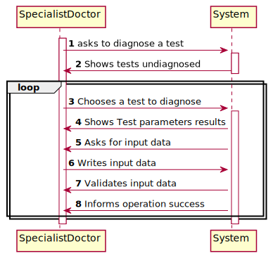
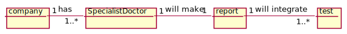
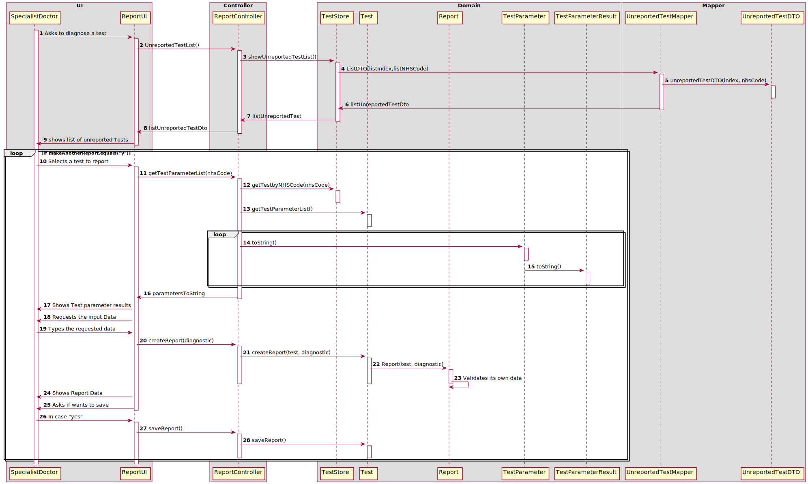
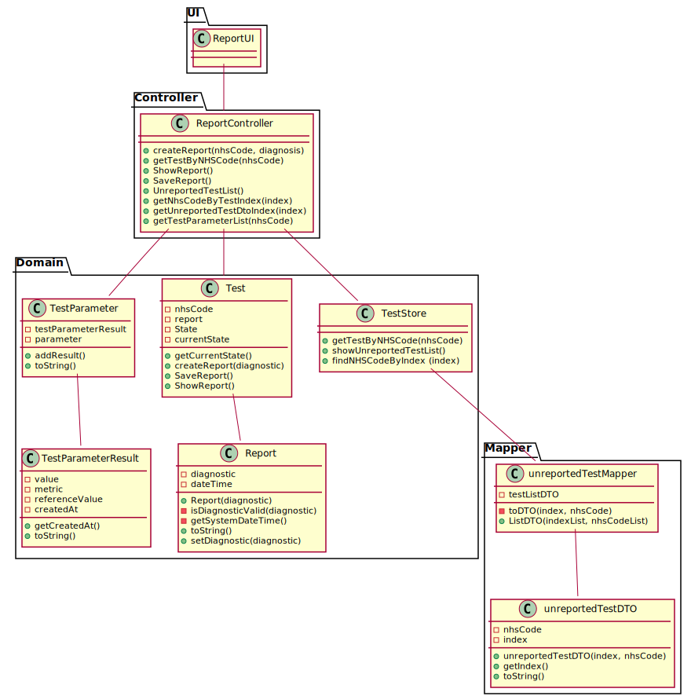

# US 014 - Make Diagnosis and Write Report

## 1. Requirements Engineering

*In this section, it is suggested to capture the requirement description and specifications as provided by the client as well as any further clarification on it. It is also suggested to capture the requirements acceptance criteria and existing dependencies to other requirements. At last, identfy the involved input and output data and depicted an Actor-System interaction in order to fulfill the requirement.*

### 1.1. User Story Description

*As a specialist doctor, I intend to make the diagnosis and write a report for a given test.*

### 1.2. Customer Specifications and Clarifications 

*Insert here any related specification and/or clarification provided by the client together with **your interpretation**. When possible, provide a link to such specifications/clarifications.*

**Document specifications and Clarifications:**

After completing the chemical analysis, the results of all chemical analyses are analysed by a specialist doctor who makes a diagnosis and writes a report that afterwards will be delivered to the
client.

**Client Specifications and Clarifications:**

Q: Once the specialist doctor decides to write the report for a given test, should the results of the chemical analysis and the reference values be presented on the screen? If not, how should the specialist doctor access the data related to the diagnosis he needs to make?
A: After selecting a test (to make the diagnosis/report) the results of the chemical analysis and the reference values should be presented on the screen. Then the Specialist Doctor should write the report.
Please check my previous post: https://moodle.isep.ipp.pt/mod/forum/discuss.php?d=8250#p10889

Q: While in the "Make a diagnosis and write a report" option of the main menu, should the specialist doctor be able to make a diagnosis and write a report for more than one test? Or does he need to exit and enter the "Make a diagnosis and write a report" option every time he wants to make a new diagnosis and write a new report?
A: After writing a report the SD can choose to write other reports without leaving the use case.

Q: When the report becomes available in the system, should the system inform that the operation was successful?
A: Please check the Project Description document.

Q:When Starting a new report how does the specialist doctor interacts with the system? by choosing a client with a test result(that doesn´t have a report yet) or a test result from a client? and how do you want the system to show that information?
A: I already answered this question.

Q: Regarding the tests that the Specialist Doctor can write a report about. Should the SD chose from a list of tests? and Should him only receive a list of test that have completed all the previous steps?
A: The system shows all tests ready (that have completed all the previous steps) to make the diagnosys and the Specialist Doctor selects one test. Then, the Specialist Doctor writes the report for the selected test.

Q: If the report is not validated by the Lab Coordinator, can it be due to the report and diagnosis or are all of the reports and diagnosis written valid?
A: I already answered this question.

### 1.3. Acceptance Criteria

*Insert here the client acceptance criteria.*

### 1.4. Found out Dependencies

US12: As a clinical chemistry technologist, I intend to record the results of a given test.

### 1.5 Input and Output Data

*Identity here the data to be inputted by the system actor as well as the output data that the system have/needs to present in order to properly support the actor actions. Regarding the inputted data, it is suggested to distinguish between typed data and selected data (e.g. from a list)*

**Input data:**
test (selected from among a list)
diagnosis (typed)

**Output data:**

new report
success in creating a new report

### 1.6. System Sequence Diagram (SSD)

*Insert here a SSD depicting the envisioned Actor-System interactions and throughout which data is inputted and outputted to fulfill the requirement. All interactions must be numbered.*

### 1.7 Other Relevant Remarks

*Use this section to capture other relevant information that is related with this US such as (i) special requirements ; (ii) data and/or technology variations; (iii) how often this US is held.* 

## 2. OO Analysis

### 2.1. Relevant Domain Model Excerpt 
*In this section, it is suggested to present an excerpt of the domain model that is seen as relevant to fulfill this requirement.* 

### 2.2. Other Remarks

*Use this section to capture some aditional notes/remarks that must be taken into consideration into the design activity. In some case, it might be usefull to add other analysis artifacts (e.g. activity or state diagrams).* 

## 3. Design - User Story Realization 

### 3.1. Rationale

**The rationale grounds on the SSD interactions and the identified input/output data.**

| Interaction ID | Question: Which class is responsible for... | Answer  | Justification (with patterns)  |
|:-------------  |:--------------------- |:------------|:---------------------------- |
| Step 1 Asks to diagnose a test		 |	instantiate a report?					 | test     |  Creator pattern: 1/2        |
| Step 2 Shows tests undiagnosed 		 |	Showing the list of tests undiagnosed?	 | testStore       |  Information Expert: Knows all undiagnosed tests     |
| Step 3 Chooses a test to diagnose 	 |	choosing the test from the list?		 |             |                         |
| Step 4 Shows Test parameter results		     |	showing test parameters results?		| testParameter             | Information Expert: Knows its own data                         |
| Step 5 Asks for input Data 		     |	requesting input Data?					 |             |                         |
| Step 6 Writes input Data 		         |	saving the input Data?					 | Report  |  Information Expert: stores its own data |
| Step 7 Validates Input Data 		     |	validating the input data?				 | Report   | Information Expert: diagnostic knows its own data and its own validations  |          
| Step 8 Informs Operation Success 		|  informing the operation success?			| UI          | Information Expert: User-System interface                          |              

### Systematization ##

According to the taken rationale, the conceptual classes promoted to software classes are: 

 * Comapny
 * LabCord
 * testStore
 * test
 * TestParameter
 * TestParameterResults
 * report

Other software classes (i.e. Pure Fabrication) identified: 
 
 * reportUI  
 * reportController
 

## 3.2. Sequence Diagram (SD)

*In this section, it is suggested to present an UML dynamic view stating the sequence of domain related software objects' interactions that allows to fulfill the requirement.* 

## 3.3. Class Diagram (CD)

*In this section, it is suggested to present an UML static view representing the main domain related software classes that are involved in fulfilling the requirement as well as and their relations, attributes and methods.*

# 4. Tests 
*In this section, it is suggested to systematize how the tests were designed to allow a correct measurement of requirements fulfilling.* 

**_REPORT_**

**Test 1:** Check that it is not possible to create an instance of the Report class with diagnosis empty. 

	@Test(expected = IllegalArgumentException.class)
    public void setDiagnosticReturnsException1(){

        controller.createReport(nhsCode1,diagnosticF1);
    }
    
**Test 2:** Check that it is not possible to create an instance of the Report class with diagnosis null.

    @Test(expected = IllegalArgumentException.class)
    public void setDiagnosticReturnsException2(){
        Report rep12= new Report(diagnosticF2);

    }

**_ReportController_**

**Test 3:** Check that is not possible to create a Report with an NHS Code unrelated to the Tests in the store and diagnosis invalid (empty and null).

    @Test(expected = IllegalArgumentException.class)
    public void testCreateReportExceptions() {
        controller.createReport(nhsCodeInv,diagnosis);
        controller.createReport(nhsCode,diagnosisInv2);
        controller.createReport(nhsCode,diagnosisInv1);
    }

*It is also recommended to organize this content by subsections.* 

# 5. Construction (Implementation)

*In this section, it is suggested to provide, if necessary, some evidence that the construction/implementation is in accordance with the previously carried out design. Furthermore, it is recommeded to mention/describe the existence of other relevant (e.g. configuration) files and highlight relevant commits.*

In this story the Specialist Doctor calls to create a report with the UI that makes contact with the controller. Then the controller
will call the store to identify the Tests that are able to undergo report making. Once they are identified, the store sends this List
to a Mapper that will transform the identification of the Tests into a DTO. This List of DTO will be returned to the UI and then will be shown to the Client. The client will pick one test to make a report and the results of that test will be shown, once the diagnosis is made, it will be validated, if it is a valid report, the system will ask the user if he wants to save the report.

*It is also recommended to organize this content by subsections.* 

# 6. Integration and Demo 

To integrate this user story i had first to create a Client and store him, after then i had to register a client to make a Test and 
store the test. Then a clinical chemistry technologist would insert the values to the test. Then at the moment of selecting the test to make a report, this values would be shown, and the specialist doctor would be able to make a report based on this tests
*In this section, it is suggested to describe the efforts made to integrate this functionality with the other features of the system.*

# 7. Observations
Overall i think i made a good work, obviously with flaws, like i could have incorporated more DTO's, but with the time and structure of my group i think it was a good work. In the future perhaps i will incorporate the DTO's and organize and improve the code. 
*In this section, it is suggested to present a critical perspective on the developed work, pointing, for example, to other alternatives and or future related work.*

