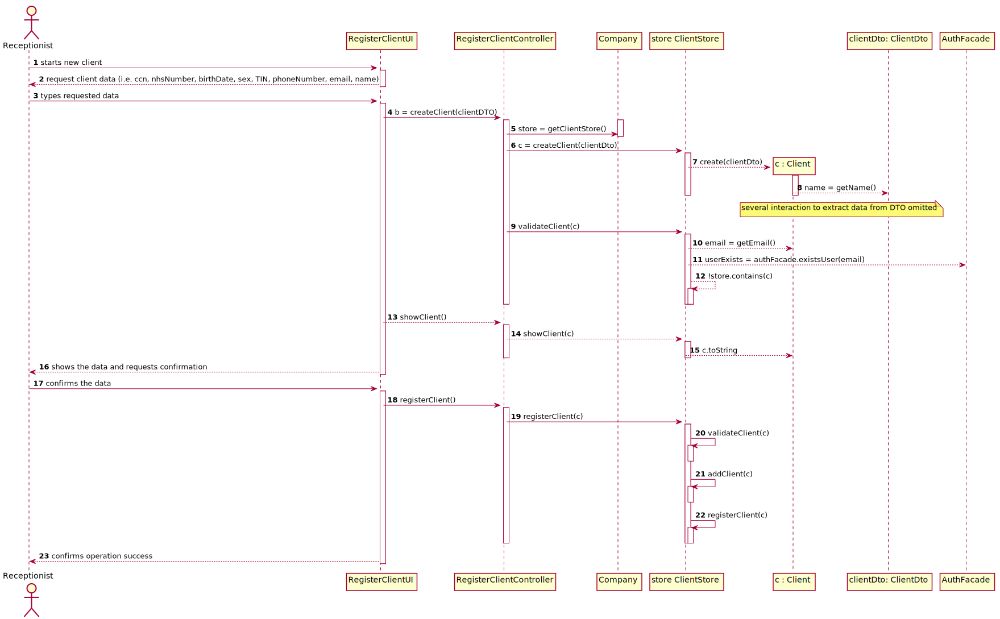

# US 003 - Register New Client

## 1. Requirements Engineering

*In this section, it is suggested to capture the requirement description and specifications as provided by the client as well as any further clarification on it. It is also suggested to capture the requirements acceptance criteria and existing dependencies to other requirements. At last, identfy the involved input and output data and depicted an Actor-System interaction in order to fulfill the requirement.*

### 1.1. User Story Description

*As a receptionist of the laboratory, I want to register a client.*

### 1.2. Customer Specifications and Clarifications 

**From the specifications document:**

- "In case of a new client, the receptionist registers the client in the application. To register a client, the receptionist needs the client’s citizen card number, National Healthcare Service (NHS) number, birth date, sex, Tax Identification number (TIF), phone number, e-mail and name"  
- "All those who wish to use the application must be **authenticated with a password** holding seven alphanumeric characters, including three capital letters and two digits."

**From the client clarifications:**

> - **Q:** "To register a client the receptionist needs the client’s citizen card number, National Healthcare Service (NHS) number, birth date, sex, Tax Identification number (TIF), phone number, e-mail and name. Which type/format they should have?"  
    -  Citizen Card: 16 digit number;  
    -  NHS: 10 digit number;  
    -  TIN: 10 digit number;  
    -  Birth Date Format: DD/MM/YY;  
    -  Sex: Male/Female;  
    -  Phone number: 11 digit number;  

 

> - **Q:** "Also, are all the fields required/mandatory?"  
> - **A:** The phone number is opcional. All other fields are required.  

 

> - **Q:** Does the receptionist need to be logged in the app to perform the register?  
> - **A:**Yes.  

 

> - **Q:** What parameter (asked by the receptionist) should the system use to create the password of the new client?  
> - **A:** The password should be randomly generated. It should have ten alphanumeric characters.  

 

> - **Q:** How are the passwords delivered to the users (client/employee)?
> - **A:** Each users receives an e-mail informing that the registration was successful and that he can start to use the system. The e-mail includes the user password. For now it will be done via text file.

 

> - **Q:** Relative to registering a new user, how should the system respond in the event of creating a new user with the same attributes of an already existing user?  
> - **A:** This should be treated as an error. A subset of the attributes of any client are unique.   

 

> - **Q:** When the receptionist is registering a test, does the client needs to pay?
> - **A:** There are costs and payments but they are managed by a third party and are outside of the system. Therefore, in this project we will not consider the cost and payments associated with each test.

 

> - **Q:** What should be the maximum length of the String with the name of the Client?
> - **A:** A string with no more than 35 characters.

 

> - **Q:** Does the email have to be validated as a valid address or do we just accept whatever input the receptionist writes?
> - **A:** You should use a regular expression to validate the e-mail address.

 

> - **Q:** Also, does the phone number has to be validated as a valid phone number? And can it be registered with a prefix (+44) or just the number?
> - **A:** This lab only operates in England, there is no need to use the prefix.

 

### 1.3. Acceptance Criteria

* **AC01:** The client must become a system user.  
* **AC02:** The “auth” component available on the repository must be reused (without modifications)  
* **AC03:** The following fields must be unique for each client: citizen card number, NHS number, TIN, phone number, and e-mail address. When this condition is not met, the system must reject the operation and the user must have the chance to modify the invalid typed data. 
* **AC04:** The sex of each user is optional.  
* **AC05:** Citizen Card number must have 16 digits.
* **AC06:** Name must be a string with no more than 35 characters.
* **AC07:** NHS number must have 10 digits.
* **AC08:** TIN must have 10 digits.
* **AC09:** Birth day must have the format: DD/MM/YYYY. A client should not have more than 150 years of age.
* **AC10:** Sex options: Male/Female.
* **AC11:** Phone number must have 11 digits.
* **AC12:** E-mail address must have 11 digits and validation must use a regular expression.
* **AC13:** The password should be randomly generated. It should have 10 alphanumeric characters.
* **AC14:** The client receives an e-mail informing that the registration was successful and that he can start to use the system. The e-mail includes the client password. All the e-mail messages should be written to a file with the name emailAndSMSMessages.txt.

### 1.4. Found out Dependencies

- User Story 7 - receptionist must be a registered employee

### 1.5 Input and Output Data

*Identity here the data to be inputted by the system actor as well as the output data that the system have/needs to present in order to properly support the actor actions. Regarding the inputted data, it is suggested to distinguish between typed data and selected data (e.g. from a list)*

* Input Data  
	- Typed data: ccn, nhsNumber, tin, phoneNumber, email, name, birthDate 
	- Selected data: sex. 
* Output Data  
	- (In)Sucess of the operation 

### 1.6. System Sequence Diagram (SSD)

*Insert here a SSD depicting the envisioned Actor-System interactions and throughout which data is inputted and outputted to fulfill the requirement. All interactions must be numbered.*

### 1.7 Other Relevant Remarks

*Use this section to capture other relevant information that is related with this US such as (i) special requirements ; (ii) data and/or technology variations; (iii) how often this US is held.* 

## 2. OO Analysis

### 2.1. Relevant Domain Model Excerpt 
*In this section, it is suggested to present an excerpt of the domain model that is seen as relevant to fulfill this requirement.* 

### 2.2. Other Remarks

*Use this section to capture some aditional notes/remarks that must be taken into consideration into the design activity. In some case, it might be usefull to add other analysis artifacts (e.g. activity or state diagrams).* 

## 3. Design - User Story Realization 

### 3.1. Rationale

**The rationale grounds on the SSD interactions and the identified input/output data.**

| Interaction ID | Question: Which class is responsible for... | Answer  | Justification (with patterns)  |
|:-------------  |:--------------------- |:------------|:---------------------------- |
| Step 1  | ... interacting with the actor? | RegisterClientUI   |  **Pure Fabrication:** there is no reason to assign this responsibility to any existing class in the Domain Model           |
|                    |  ... coordinating the US? | RegisterClientController | **Controller**      
| Step 2: requests data (i.e. ccn, nhsNumber, birthDate, sex, TIN, phoneNumber, email, name)  |	...requesting the Client's data	 | UI | IE: Responsible for user interaction |
| Step 3  | ...transfer the data typed in the UI to the domain? | ClientDto | **DTO:** When there is so much data to transfer, it is better to opt by using a DTO in order to reduce coupling between UI and domain |
|   | ...saving the input data?	|  Client   | IE: the object created in step 1 has its own data  |
| | ...instantiating a new Client? |  ClientStore    |  **Creator (R1)** and **HC+LC (Pure Fabrication)**: By the application of the Creator (R1) it would be the "Company". But, by applying HC + LC to the "Company", this delegates that responsibility to the "ClientStore"      |
|   |  ... knowing the ClientStore?   |  Company   |  **IE:** Company knows the ClientStore to which it is delegating some tasks |
|                    |  ... validating all data (local validation)? | Client | **IE:** an object knows its data|
|                    |  ... validating all data (global validation)? | ClientStore | **IE:** knows all the clients| 
|                    | ... validate the exclusivity of the client's email? | AuthFacade | **IE:** user management is responsibility of the respective external component whose point of interaction is through the class "AuthFacade"
| Step 4: shows the data and requests confirmation 	|...validating the data locally (e.g.: mandatory vs.non-mandatory data)? | Client | IE  |
| 	|... validating the data globally (e.g.: duplicated)? | ClientStore | IE: knows all the registered clients && Pure Fabrication |
| Step 5 |  ... generating the password? | PasswordGenerator | **IE** and **Pure Fabrication:** ClientStore has all the required information and means to generate the password (IE). However, to avoid code duplication (cf. US7) this responsibility might be assign to a common and shared artificial class, specialized in this task.|
|                    |  ... registering the client as a system user? | AuthFacade | **IE:** cf. A&A component documentation | 
|                    |  ... saving the client? | ClientStore | **IE:** Knows all clients| 
|                    |  ... sending email? | EmailNotificationSender | **IE** and **Pure Fabrication:** has all the required information and means to send the email (IE). However, to avoid code duplication (cf. US7) this responsibility might be assign to a common and shared artificial class, specialized in this task.| 
| Step 6: informs operation success  |	...informing operations success	 | UI |  IE: Responsible for user interaction |  

### Systematization ##

According to the taken rationale, the conceptual classes promoted to software classes are: 

 * Receptionist
 * Company
 * Client

Other software classes (i.e. Pure Fabrication) identified:  
 * registerClientUI  
 * registerClientController
 * ClientStore
 * ClientDto
 * PasswordGenerator
 * EmailNotificationSender

 Other software classes of external systems/components:

* AuthFacade

## 3.2. Sequence Diagram (SD)

*In this section, it is suggested to present an UML dynamic view stating the sequence of domain related software objects' interactions that allows to fulfill the requirement.* 

**Remark 1:** To simplify the US3 SD, the method for registering clients within the ClientStore is shown independently. 

**Remark 2:** As suggested by the professors, I adopted the method of Client Store creation in a way that it knows the AuthFacade to then check for the existence of duplicate registered users and add new ones. 

## 3.3. Class Diagram (CD)

*In this section, it is suggested to present an UML static view representing the main domain related software classes that are involved in fulfilling the requirement as well as and their relations, attributes and methods.*

# 4. Tests 

I tested three classes: the Client model class, the RegisterClientController class and the ClientStore Class. Initially I was testing the invalid fields on the RegisterClientControllerTest Class, given that the handling of exceptions was done in the Controller class, thus it would be easier to test *n* different situations of invalid fields, without having to separate it into *n* test classes. I since changed the controller class to use the authorization mechanism, therefore I had to test it directly in the ClientTest class. 

## 4.1 Client Model Class

**Test 1:** Check that it is not possible to create an instance of the Client class with null values. 

	@Test(expected = IllegalArgumentException.class)
		public void ensureNullIsNotAllowed() {
		Client client = new Client(null, null, null, null, null, null, null, null);
	}

**Test 2:** Check that the age of the client was being correctly calculated. 
    
    @Test
    public void getAge() {
        //c1 and c2 are clients created on the setUp method
        int result = c1.getAge();
        int result2 = c2.getAge();
        assertEquals(expectedAge, result, 0.01);
        assertEquals(expectedAge2, result2, 0.01);
    }

**Test 3:** Check that the get method was working as intended.

    @Test
    public void getName() {
        String expectedName = "Luisa";
        String name = c3.getName();
        assertEquals(expectedName, name);
    }

This was replicated for each attribute.

**Test 4:** Check that the getBirthDate method did not return the original object nor that it was null.

    @Test
    public void getBirthDate() {
        Date dateTest = c1.getBirthDate();
        assertNotSame(date, dateTest);
        assertNotNull(dateTest);
    }

**Test 5:** Check that the equals method was working as intended.

**Test 6:** Check that the compareTo method was working as intended.

*The compareTo method was implemented for the future feature of sorting clients*

**Test 7:** Check that it is not possible to create an instance of the Client class with invalid name values, since it could not be bigger than 35 chars nor empty or null. In this one, the name is too long.
   
    @Test(expected = IllegalArgumentException.class)
    public void ensureTooLongNameIsNotAllowed() {
        Client client = new Client("Rui Filipe Lobo Rocha Soares Vasques Bernardes", date, Client.Sex.MALE, 1234567890123456, 1234567890, 1234567890, 12345678901, "1200735@isep.ipp.pt");
    }

**Test 8:** Check that it is not possible to create an instance of the Client class with invalid citizen card numbers, since it had to be between 4 and 8 numerical chars. In this one, the ccn has a letter.
   
    @Test(expected = IllegalArgumentException.class)
    public void ensureCodeWithNonNumericalCharIsNotAllowed() {
        Client client = new Client("Rui Filipe Lobo Rocha", date, Client.Sex.MALE, 1234567890123f45", "1234567890", "1234567890", "12345678901", "1200735@isep.ipp.pt");
    }

These two last tests are two examples of the different validations of the fields. These were replicated for every attribute and situation.

## 4.2 RegisterClientController Class

**Test:** Check that it is not possible to create an instance of the Controller without being logged in as receptionist.

    @Test(expected = IllegalStateException.class)
    public void ensureNonAuthorizedUserCantAccessController() {
        RegisterClientController registerClientController = new RegisterClientController();
    }

## 4.3 ClientStore Class

**Test 1:** Check that it is not possible to add an instance of the Client class to the store with the same Citizen Card Number.
  
    @Test
    public void addClientSameCcn() {
        Client c1 = new Client("Rui Rocha", date, Client.Sex.MALE, "1234567890123456",
                "1234567890", "1234567890", "12345678909", "ruirocha0@hotmail.com");
        clientStore.addClient(c1);

        Client c2 = new Client("Pedro Carvalho", date, Client.Sex.MALE, "1234567890123456",
                "5364789287", "7487364523", "73648276354", "pedro0@hotmail.com");
        boolean result = clientStore.addClient(c2);
        assertFalse(result);
    }

This was replicated for each attribute.

# 5. Construction (Implementation)

*In this section, it is suggested to provide, if necessary, some evidence that the construction/implementation is in accordance with the previously carried out design. Furthermore, it is recommeded to mention/describe the existence of other relevant (e.g. configuration) files and highlight relevant commits.*

## 5.1 Client Class

This class holds the necessary attributes for the Client (i.e. name, birth date, sex, citizen card number, nhs number, tin number, phone number and email) and the respective validations. In case some of the attributes is invalid (either when creating the instance or modifying it), the validation method will throw an exception that will be handled in the RegisterClientController.

## 5.2 ManageClientUI Class

This class was made to facilitate our future work, given that it is expected to be possible to edit client's data or even remove it. Therefore, it serves as a menu where the receptionist can choose what they want to do, that will guide them to the appropriate UI.

## 5.3 RegisterClientUI Class

This class is responsible for the input and output of data for the Client. 
It begins with trying to create an instance of the RegisterClientController, which will only be successful if the person trying to access it is logged in with the appropriate role (Receptionist). Then it asks the receptionist for all the necessary data. In case the Client is successfully created (i.e. none of the validity exceptions was thrown, nor the client is a duplicate of an already existing one), it shows the receptionist all the information for confirmation. Once confirmed, it outputs the success of the operation.

## 5.4 RegisterClientController Class

This class uses the app singleton to get the company and then the associated Parameter Category store, to then act upon it, by creating and adding clients. The create() method is responsible for this instantiation and also for checking if the user is logged in with the Receptionist role.
It is also responsible for the registration of the client as an user of the system, by using the provided "auth" component. If the creation and registration are successful, it generates a random 10 alphanumerical character password, with it's own method, and writes this info to a text file called "emailAndSMSMessages.txt", simulating the email/SMS to the client when their account is created.

# 6. Integration and Demo 

Using the "auth" component, the registered user can then become a user of the system and use their own UI for future features.

# 7. Observations

In Sprint B I was able to implement the Model View Controller solution, implementing a ClientStore to handle all the clients of the system, the Controller to handle all operations and the UI layer just for input and output of data.
In the future I want to explore the use of a Data Transfer Object (DTO) to create the client instead of sending every attribute. This would make it easier for the future to add a new attribute (for example, insurance number);

**Some other things I want to develop:**

* A Date class where I can handle the possible date values for the days, month and years, so that the user can select them instead of writing it down and being presented with an error later on.
* Maybe change the way the enums of the Sex are handled. For now they are directly called from the Client class to the RegisterClientUI class. [Edit(15/05): It is called from the clientDto].
* I'll consider moving the generateRandomPassword() and writeDataToFile() in the Utils class, so that it can be reused for US7 instead of duplicating the code. [DONE]

