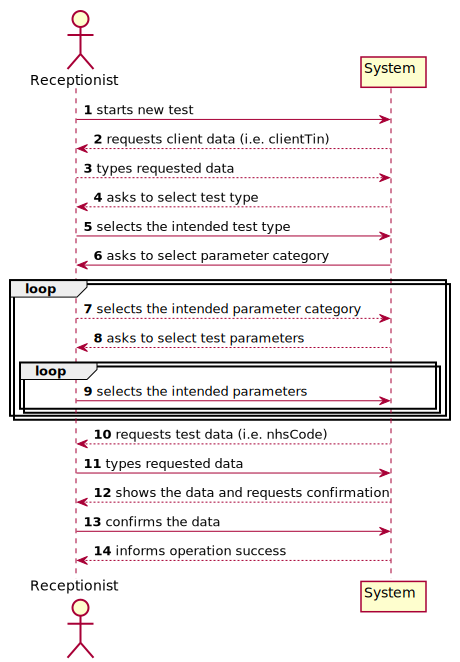
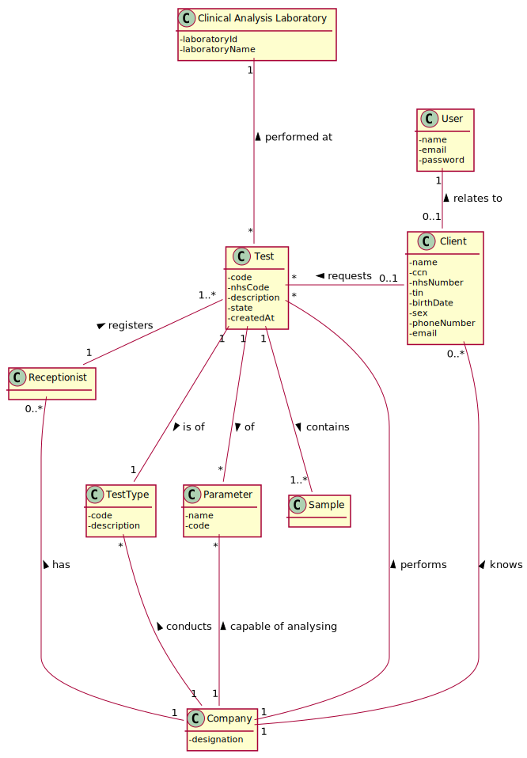
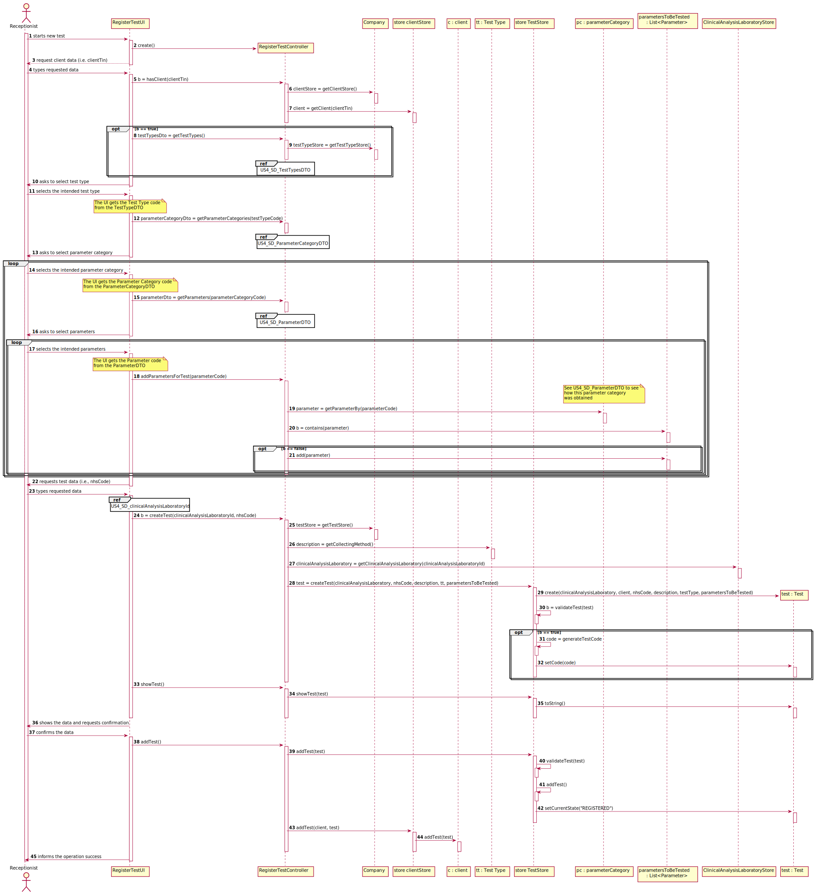
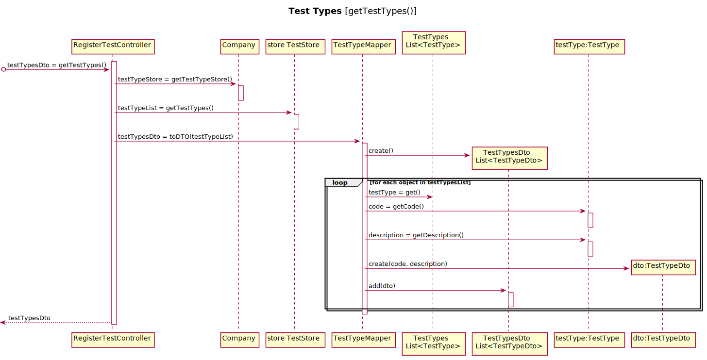
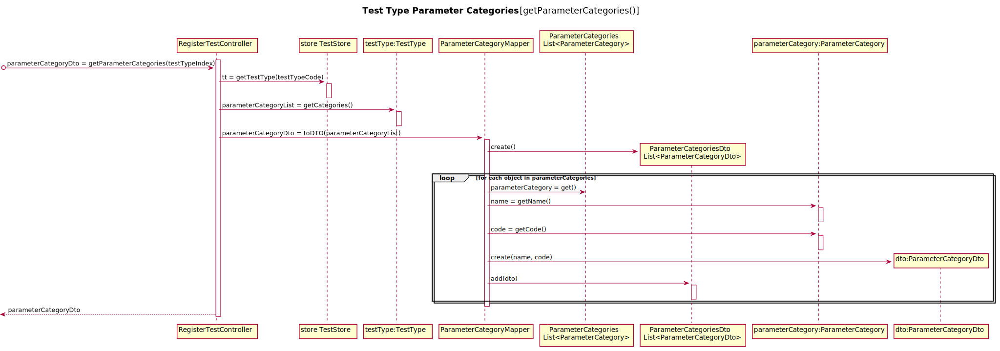
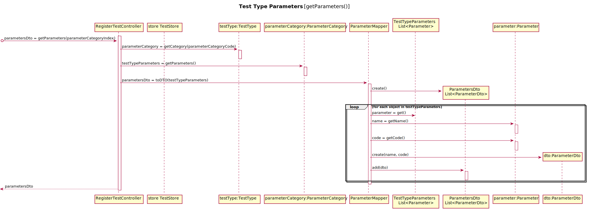
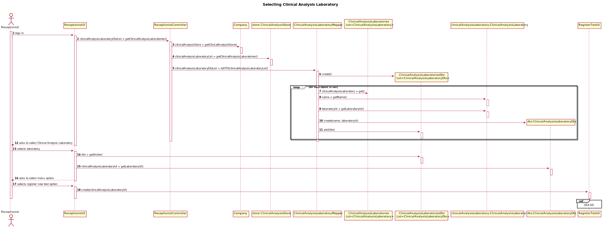
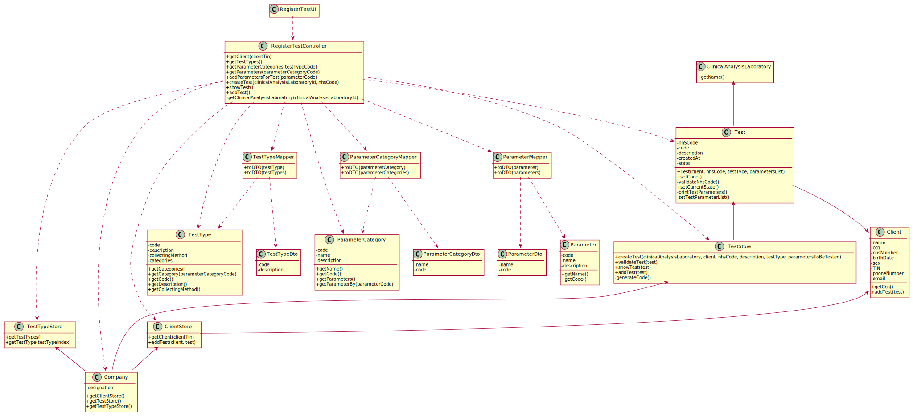
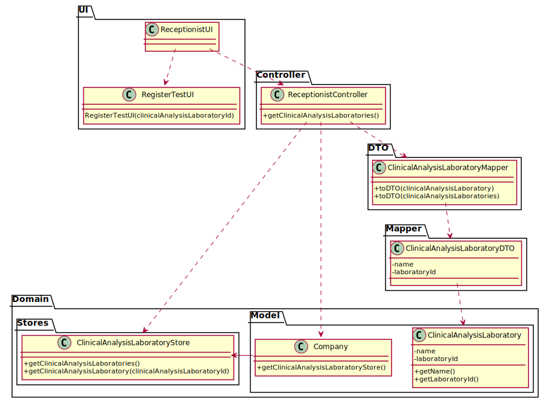

# US 004 - Register New Test

## 1. Requirements Engineering

### 1.1. User Story Description

*As a receptionist of the laboratory, I intend to register a test to be performed to a registered client.*

### 1.2. Customer Specifications and Clarifications 

**From the specifications document:**

- "Typically, the client arrives at one of the clinical analysis laboratories with a lab order prescribed by a doctor. Once there, a receptionist asks the client’s citizen card number, the lab order (which contains the type of test and parameters to be measured), and registers in the application the test to be performed to that client. Then, the client should wait until a medical lab technician calls him/her to collect the samples required to perform a given test."
- "All the tests (clinical blood tests and Covid-19 tests) performed by the network of laboratories are registered locally by the medical lab technicians who collect the samples. The samples are sent daily to the chemical laboratory where the chemical analyses are performed, and results obtained. When sampling (blood or swab) the medical lab technician records the samples in the system, associating the samples with the client/test, and identifying each sample with a barcode that is automatically generated using an external API."
- "Many Labs performs two types of tests. Each test is characterized by an internal code, an NHS code, a description that identifies the sample collection method, the date and time when the samples were collected, the date and time of the chemical analysis, the date and time of the diagnosis made
by the specialist doctor, the date and time when the laboratory coordinator validated the test, and the test type (whether it is blood test or Covid test):

	* Blood tests are frequently characterized by measuring several parameters which for presentation/reporting purposes are organized by categories. For example, parameters such as the number of Red Blood Cells (RBC), White Blood Cells (WBC) and Platelets (PLT) are usually presented under the blood count (Hemogram) category,
	* Covid tests are characterized by measuring a single parameter stating whether it is a positive or a negative result.
	* Other tests support: Despite being out of scope, the system should be developed having in mind the need to easily support other kinds of tests (e.g., urine). Regardless, such tests rely on measuring one or more parameters that can be grouped/organized by categories."

**From the client clarifications:**
  
>- **Question:** Does the client want to specify more than one new parameter at a time?
>- **Answer:** Yes.

 

>- **SW Client**: The date and time when the samples are collected attributes must be registered in the application.  If these attributes are in the Project Description, it is because the client is interested in registering this data.

 

>- **Question:** ”If the client needs to perform more than one test, can a lab order contain multiple tests or does the client need multiple lab orders?"
>- **Answer:** Each lab order is for only one test. N prescriptions (lab orders) give rise to N Tests.

 

>- **Question:** ”In the project description we get: "Typically, the client arrives at one of the clinical analysis laboratories with a lab order prescribed by a doctor.”. Who is this doctor?"
>- **Answer:** This doctor is someone outside the system that prescribed the lab order.

 

>- **Question:** ”Is the Test mentioned in the lab order selected by the receptionist after she identifies it in the Order, or is it like a code that pertains to a specific test which must be entered by the receptionist?"
>- **Answer:** The receptionist should read the lab order and should select the code using the application.

 

>- **Question:** "Since the Client has a Lab Order which contains the type of test and all the parameters to be measured, all the parameters selected by the Receptionist need to be equal to the Lab Order's parameters?""
>- **Answer:** Yes.

 

>- **Question:** About the other Test attributes, do we need to have in consideration any other criteria? Is the code generated or NHS code optional ?
>- **Answer:** All test attributes are mandatory. The test attributes are the following:
	- Test code : sequential number with 12 digits. The code is automatically generated.
	- NHS code: 12 alphanumeric characters.

 

>- **Question:** When the receptionist is registering a test for a client, the test can have more than one category and many parameters of the chosen categories or it only can have one category?
>- **Answer:** Each test can have more than one category.

 

>- **Question:** I wanted to ask if the NHS code of which test is unique or not.
>- **Answer:** Yes.

 

>- **Question:** In the case of the Covid test, should the step of choosing a parameter be ignored in this case, i.e., should the app not even ask if the receptionist wants to add a parameter, given that there is only one parameter associated?
>- **Answer:** No. Who said that we only have one parameter for a Covid test? 

 

>- **Question:** On the project description it says "Each test is characterized by an internal code, an NHS code, a description that identifies the sample collection method...". You said that the code is a 12 digit sequential number. Does this mean that, for example, the first test will have the code "000000000001" and so on?
>- **Answer:** Yes.

 

>- **Question:** And should the description that identifies the sample collection method be automatically filled with the collection method associated with the type of test?
>- **Answer:** Yes. In a previous post I said that "There exists only one collection method per test type".

 

>- **Question:** On the project description we have multiple attributes of date and time ("date and time when the samples were collected", etc). Are these attributes filled by the author of the respective act or is it generated by the system when those acts are performed?
>- **Answer:** The system should automatically generate the date and time of the event (test registration, chemical analysis, diagnosis and validation).

 

>- **Question:** When the receptionist chooses the test type, should the categories appear, and then when selecting the category, the receptionist can choose the parameters for the test? Or when the Receptionist chooses the test type, should appear all the parameters that it includes immediately?
>- **Answer:** Firstly, the receptionist should choose a test type. Then choose a category from a set of categories. Last, the receptionist should choose a parameter.

 

>- **Question:** Shouldn't the receptionist locate the Client by the Citizen Card Number instead of TIN Number?
>- **Answer:** The receptionist should use the TIN number to find the client.

 

>- **Question:** Should we show the list of all clients available or just introduce the client's CCN ?
>- **Answer:** The TIN number should be used to find a client and associate the client with the test.

 

>- **Question:** You've said on previous questions that the NHS code contains 12 characters and is alphanumeric, so this will be different from the NHS number from the client, am I right? If so, how do we know a certain test is associated to a client?
>- **Answer:** A test has a NHS code and a client has a NHS number. In US4 the receptionist of the laboratory should ask the client to get his TIN number. Using the TIN number the receptionist of the laboratory can find all information about the client. Do not forget that a client should be registered in the system to make a test.

 

>- **Question:** Can the client have two identical tests? or the system should stop from creating the same test?
>- **Answer:** A test is unique in the system.

 

>- **Question:** We are aware that both the receptionist and the MLT are two employees that may work on different labs. As such, do you want that Tests become associated to a specific Lab?
>- **Answer:** Yes.

 

>- **Question:** This means that, when the receptionist creates a new Test, this test will only be "visible" for that specific LAB (for the receptionist and the MLT only), which means that all other roles (Chemistry Technologist, Specialist Doctor and the Laboratory Coordinator) will be able to see a list of all the tests performed in any lab.
>- **Answer:** Yes. The test will only be visible for that specific LAB and for all those working in the Chemical Laboratory.

 

>- **Question:** How is it possible to know in which laboratory the test is being registered? Should the Receptionist select the Laboratory before selecting the Test Type?
>- **Answer:** After login the receptionist should select the laboratory where she is working. Then, the receptionist has access to the system's features/functionalities.

 

### 1.3. Acceptance Criteria

* **AC01:** The receptionist must select the parameters to be analysed from all possible parameters in accordance with the test type. 
* **AC02:** The receptionist must be able to select more than one parameters. 
* **AC03:** One lab order = one test = one test type.
* **AC04:** Test internal code must be a sequential number with 12 digits. It is automatically generated.
* **AC05:** NHS code must have 12 alphanumeric characters and should be unique.
* **AC06:** The description should be filled with the collection method associated with the chosen test type.
* **AC07:** The system should automatically generate the date and time of the event (test registration, chemical analysis, diagnosis and validation).
* **AC08:** The existence of the client in the system should be checked with the Tax Identification Number.
* **AC09:** The test should be associated to a specific lab. This lab is selected by the receptionist when they log in.

### 1.4. Found out Dependencies

* **US3:** Client must be registered.
* **US7:** Receptionist must be a registered employee.
* **US9:** The system must have types of test to choose from.
* **US10:** The system must have parameters to choose from.

### 1.5 Input and Output Data

**Input Data:**

* **Typed data:**
	* Client Tax Identification Number
	* Test NHS Code
	
* **Selected data:**
	* Test Type
	* Parameter Categories
	* Parameters

**Output Data:**

* (In)Success of the operation

### 1.6. System Sequence Diagram (SSD)

### 1.7 Other Relevant Remarks

*Use this section to capture other relevant information that is related with this US such as (i) special requirements ; (ii) data and/or technology variations; (iii) how often this US is held.* 

## 2. OO Analysis

### 2.1. Relevant Domain Model Excerpt 

### 2.2. Other Remarks

*Use this section to capture some aditional notes/remarks that must be taken into consideration into the design activity. In some case, it might be usefull to add other analysis artifacts (e.g. activity or state diagrams).* 

## 3. Design - User Story Realization 

### 3.1. Rationale

**The rationale grounds on the SSD interactions and the identified input/output data.**

| Interaction ID | Question: Which class is responsible for... | Answer  | Justification (with patterns)  |
|:-------------  |:--------------------- |:------------|:---------------------------- |
| Step 1  		 |...interacting with the actor? | RegisterTestUI  |  **IE:** Responsible for user interaction    |
|                |... coordinating the US? | RegisterClientController | **Controller**  
| Step 2         |...requesting the Client's data(i.e. CCN)	 | RegisterTestUI | **IE:** Responsible for user interaction |
| Step 3  		 | ...getting the client?	 | ClientStore     |  **Creator (R1)** and **HC+LC (Pure Fabrication)**: By the application of the Creator (R1) it would be the "Company". But, by applying HC + LC to the "Company", this delegates that responsibility to the "ClientStore" |
|                |  ... knowing the ClientStore?   |  Company   |  **IE:** Company knows the ClientStore to which it is delegating some tasks |
| Step 4		 |...knowing the list of test types? | TestTypeStore | **Creator (R1)** and **HC+LC (Pure Fabrication)**: By the application of the Creator (R1) it would be the "Company". But, by applying HC + LC to the "Company", this delegates that responsibility to the "TestTypeStore" | 
|                |  ... knowing the TestTypeStore?   |  Company   |  **IE:** Company knows the TestTypeStore to which it is delegating some tasks | 
|                |...providing a list of Test Types to the UI? | TestTypeDTO | **DTO:** When there is there is a need to provide a list of objects to choose, it is better to opt by using a DTO in order to reduce coupling between UI and domain |  
|                |...converting the list of test types to a list of DTOs | TestTypeMapper | **DTO** |  
| Step 5  		 |...getting the chosen Test Type? | TestTypeStore  | **Creator (R1)** and **HC+LC (Pure Fabrication)**   |
| Step 6  		 |...knowing the list of the test type's parameter categories?	| TestType  | **IE:** an object knows its data  | 
|                |...providing the list of Parameter Categories to the UI? | ParameterCategoryDTO | **DTO:** When there is there is a need to provide a list of objects to choose, it is better to opt by using a DTO in order to reduce coupling between UI and domain |   
|                |...converting the list of test types to a list of DTOs | TestTypeMapper | **DTO** |  
| Step 7  		 |...getting the selected Parameter Category? |  TestType  |  **IE:** an object knows its data    |  
| Step 8  		 |...knowing the list of the parameter categories' parameters?	 |  ParameterCategory  |  **IE:** an object knows its data  |  
|                |...providing the list of Parameters to the UI?	 |  ParameterDTO  |  **DTO:** When there is there is a need to provide a list of objects to choose, it is better to opt by using a DTO in order to reduce coupling between UI and domain  |  
|                |...converting the list of test types to a list of DTOs	 |  ParameterMapper  |  **DTO**  |  
| Step 9  		 |...getting the selected Parameter? | ParameterCategory |  **IE:** an object knows its data  |  
|                |...saving the parameter to a list of parameters to be tested? | RegisterTestController |  **IE:** It is responsible to know the parameters that will be tested  | 
| Step 10  		 |...requesting the test data (i.e. NHS code)?	|  RegisterTestUI  | **IE:** Responsible for user interaction  |   
| Step 11 		 |...instantiating a new test? | TestStore   | **Creator (R1)** and **HC+LC (Pure Fabrication)**: By the application of the Creator (R1) it would be the "Company". But, by applying HC + LC to the "Company", this delegates that responsibility to the "TestStore"    |   
|                |...knowing the TestStore?   |  Company   |  **IE:** Company knows the TestStore to which it is delegating some tasks |  
|                |...getting the collecting method?	 |  TestType   |  **IE:** an object has its own data   | 
|                |...saving the input data?	 |  Test   |  **IE:** an object has its own data   | 
|                |...generating the internal sequential code?	 |  TestStore   |  **IE:** knows all the tests | 
|                |...validating all data (local validation)? | Test | **IE:** an object knows its data| 
|                |...validating all data (global validation)? | TestStore | **IE:** knows all the tests| 
| Step 12 		 |...print the data? | Test  |  **IE:** an object knows its data   |    
| Step 13 		 |...validating all data (global validation)? | TestStore | **IE:** knows all the tests | 
|                |  ... saving the test? | TestStore | **IE:** Knows all the tests | 
|                |  | Client | **IE:** Knows it's own tests | 
|                |...saving the client?  | Test | **IE:** Knows the associated client | 
|                |  ... changing the State of the test? | TestStore | **IE:** Knows when the test is saved | 
| Step 14 		 |...informing operations success?	 |  RegisterTestUI  |  **IE:** Responsible for user interaction   |           

### Systematization ##

According to the taken rationale, the conceptual classes promoted to software classes are: 

 * Test
 * Parameter
 * TestParameter

Other software classes (i.e. Pure Fabrication) identified: 

 * RegisterTestUI  
 * RegisterTestController
 * TestStore
 * TestTypeDTO
 * TestTypeMapper
 * ParameterCategoryDTO
 * ParameterCategoryMapper
 * ParameterDTO
 * ParameterMapper
 * ClinicalAnalysisLaboratoryDTO
 * ClinicalAnalysisLaboratoryMapper
 * ReceptionistUI
 * ReceptionistController

## 3.2. Sequence Diagram (SD)

**Remark1:** To simplify the US4 SD, the interaction use to get the Test Types, the Parameter Categories and Parameters was separated into their own interaction use diagrams. 

### 3.2.1 Test Type DTO Interaction Use

### 3.2.2 Parameter Category DTO Interaction Use

### 3.2.3 Parameter DTO Interaction Use

**Remark2:** Once the Receptionist logs in, they have to select the laboratory in which they're working on. The selected laboratory will then be associated to every new test they register.

### 3.2.4 Clinical Analysis Laboratory Selection

## 3.3. Class Diagram (CD)

**Remark1:** The class diagram got a little bit out of control due to the number of classes and a lack of understanding of the level of granularity I should use for each package, and how to divide them in different class diagrams. Hopefully It will be more organized in the next Sprint.

**Remark2:** This next class diagram shows the classes related to the selection of the laboratory by the receptionist. This one was a bit more manageable, therefore it was separated into packages.

# 4. Tests 

Directly, I tested three classes: the Test model class, the RegisterTestController class and the TestStore Class. Indirectly though, through the Controller, the DTOs and Mappers are also tested. 

## 4.1 Test Model Class

**Test 1:** Check that it is not possible to create an instance of the Test class with null values. 

    @Test(expected = IllegalArgumentException.class)
    public void ensureNullIsNotAllowed() {
        Test test = new Test(null, null,null, null, null, null);
    }

**Test 2:** Checked that getters were working accordingly.

    @Test
    public void getNhsCode() {
        String expectedNhsCode = "123456789012";
        String nhsCode = t1.getNhsCode(); // t1 is a test made on the setUp() method with the code "123456789012"
        assertEquals(expectedNhsCode, nhsCode);
    }

**Test 3:** Checked that the state Enum related methods were working correctly.

    @Test
    public void getCurrentStateCreated() {
        t1.setCurrentState(Constants.STATE_CREATED);
        String expectedState = "Created";
        String currentState = t1.getCurrentState();
        assertEquals(expectedState, currentState);
    }

**Test 4:** Checked that the setters and getters of the date were working accordingly. The set\*Date methods create a new instance of date within the system, therefore the only thing I can check is that it's not null.

    @Test
    public void getAndSetCollectionDate() {
        t1.setCollectionDate();
        Date collectionDate = t1.getCollectionDate();
        assertNotNull(collectionDate);
    }

**Test 5:** Checked that it is not possible to create an instance of Test with an NHS code that goes bellow the requirements. This was replicated for other requirements: too long NHS code, empty, null, and with invalid characters.

    @Test(expected = IllegalArgumentException.class)
    public void ensureTooShortNhsCodeIsNotAllowed() {
        Test test = new Test(cal1, client,"12345", "Description", tt1, parameterList);
    }

**Test 6:** Checked that the test results are properly stored.

    @Test
    public void addTestResult() {
        String parameterCode = "RBC00";
        double result = 4.6;
        String metric = "mg";
        t1.addTestResult(parameterCode, result, metric);
        double resultValue = t1.getTestParameterFor(parameterCode).getTestParameterResult().getValue();
        assertEquals(result, resultValue, 0.0);
    }

## 4.2 Test Store Class

**Test 1:** There are some tests similar to the tests made on the Test class (creating a test with the same NHS number).

    @Test(expected = IllegalArgumentException.class)
    public void createTestSameNhsNumber() {
        testStore.createTest(cal1, client, "123456789012", "TestDescription", tt1, parameterList);
    }

**Test 2:** Checks that not only the addTest method is working, but also the getTests() method.

    @Test
    public void getTests() {
    	t1 = testStore.createTest(cal1, client, "123456789012", "TestDescription", tt2, parameterList);
        testStore.addTest(t1);
        List<Test> tests = testStore.getTests();
        assertNotNull(tests);
    }

**Test 3:** Checks that the getTest(nhsCode) method is working accordingly.

    @Test
    public void getTest() {
        String nhsCode = "123456789012";
        Test t3 = testStore.getTest(nhsCode);
        assertEquals(t1, t3);
    }

## 4.3 Register Test Controller Class

This class, albeit more difficult to test, it helped to test the mappers and DTO classes, since it so heavily uses them. In the future this might be reconsidered though, since it doesn't seem like good practice to me to use the actual company stores and objects to make tests.

**Test 1:** This test sums all the prior ones, by getting a client, a clinical analysis laboratory, filling the list of parameters to be tested, the collecting method from the test type for the description, creating the test and adding it to the test store successfully.

    @Test
    public void addTest() {
        registerTestController.hasClient("1234567890");
        registerTestController.getParameterCategories("888");
        registerTestController.getParameters("12345");
        registerTestController.addParametersForTest("RBC00");
        registerTestController.createTest("1234", "123456789066");
        boolean added = registerTestController.addTest();
        assertTrue(added);
    }

# 5. Construction (Implementation)

## 5.1 Test Class

The test class is the "ex-libris" of the app. This class holds all the necessary attributes for the tests (i.e., an internal code, an NHS code, a description describing the collection method, relevant dates) and also contains objects necessary to all features relating to the tests:

* Client associated;
* List of collected samples;
* List of test parameters, each one containing the parameter that is being tested and corresponding result;
* Report object;
* The laboratory where the test was performed;

There is also a State enum. There are five states: Created, Registered, Samples Collected, Samples Analyzed and Validated. These states will be essential to filter the tests accordingly.

When the receptionist creates a new test, the test's NHS code is validated to make sure it is correct. In case it is not, it will throw an exception that will be handled in the RegisterTestController. The given chosen parameters list is used to put each parameter in a Test Parameter object, the date of creation is set and the test is put on the state "CREATED". Once validated for duplicates in the store, the state moves to the state "REGISTERED".

There are also some methods that are related to other user stories (US12 and US14).

## 5.2 RegisterTestUI Class

This class is responisble for the input and output of data for the Test. 
It begins by creating an instance of the RegisterTestController, which will be responsible for the interaction with the domain layer. Then, it asks the receptionist for the Client's Tax Identification Number. If the client for the entered TIN is not found, it gives the option to enter the number again, or creating a new client. If the receptionist chooses the latter, it will be forwarded to the RegisterClientUI. Once registered, this UI is resumed, where the TIN can be entered again. 

When a client is found, the UI asks the controller for a list of Test types (DTO) to present to the receptionist. He can then choose the intended test type. When they select the test type, the UI asks the controller for a list of the Parameter Categories associated to the chosen test (DTO) to present to the receptionist, for them to select the intended one. When they select one, the UI asks the controller for a list of the parameters associated to the chosen category (DTO). Once the receptionist chooses one, the UI asks them if they want to select other parameter, until there isn't any left. In case of a negative answer, it asks if the receptionist wants to select another category. In case of a positive answer, it allows them to select other category and repeating the process.

After the previous selections, the UI asks for the test's NHS code and asks the controller to create the test. If successfully created, it shows all the info pertaining to the test and asks for confirmation. If confirmed, it displays a message saying that the test was successfully added to the system.

## 5.3 RegisterTestController Class

This class is responsible for the interaction with the domain layer. It uses the app's singleton to get the company and the necessary stores (ClinicalAnalysisLaboratoryStore, ClientStore, TestTypeStore and TestStore). 
In this class there are the methods responsible to check the existence of the client (with the given TIN in the UI layer), to get the lists requested by the UI, sending these to the appropriate Mappers to be converted into lists of DTOs, and to add all the selected parameters to a list that will then be sent to the Test class at the time of it's creation. 

The createTest() method uses the given clinicalAnalysisLaboratoryId to get the laboratory object, it gets the test type collection method to fill the description, and sends these to the TestStore, alongside the client, the test type, the list of parameters to be tested and the NHS code inputted in the UI.

Other relevant method is the addTest(). This one tries to add the created test to the TestStore and to the Client. Although it was not a requirement at this moment, I thought it was relevant to the client to have the test associated, to then be able to access their tests and to have an history of tests.

## 5.4 TestStore Class

Although the Company class is the one that should know the Tests it performs, it delegates its storage to the TestStore by Pure Fabrication, to reduce its complexity.
This class is responsible for the actual creation of the tests and their global validation. If the test is not duplicated in the system, it generates a sequential 12 digit code and assigns it to the test. If duplicated, it will throw an exception that will be handled in the controller.

The addTest() method does a second global validation, adds the test to the list of tests, and changes the Test type State to "REGISTERED".

There are also some methods relevant to other user stories, such as the getTests(), that returns the list of tests, and getTest(nhsCode), which searches the store for a test with the given NHS code.

## 5.5 DTO and Mappers

These classes were made to give lists of objects to the UI layer. By using DTOs, there is a reduced coupling between the domain layer and the UI layer, by only sending the informations that are essential to present.
For example, the TestTypeDto class only has its code and description. The UI can access and present this info, but not change anything on the domain object, nor use its methods.

## 5.6 ReceptionistController Class

These class is used when the receptionist logs in. It uses the app singleton to get the company and then the list of Clinical Analysis Laboratories, that it converts to a list of DTOs, via Mapper, for the receptionist to choose the one where they are working. The chosen laboratory will then be associated to every test they register.

# 6. Integration and Demo 

The development of this functionality was commanded by the requirements of all features of the system. Since it is a central point of the app, it required a lot of integration and conversations with the rest of the team to make sure it worked for everyone the way it was intended. Some of these efforts were:

* The existence of an State enum, that allows for filtering tests by state of its life cycle. 
* The association of a Clinical Analysis Laboratory, that also allows to filter the tests according to where they were performed.
* The existence of a list of TestParameters, which hold the parameter to be tested and the corresponding result.
* A method to add the test result, which was needed for the development of the US12.

# 7. Observations

In Sprint C, I was able to adopt the DTO and Mapper solution, that was needed multiple times throughout the functionality, something that I was not able to do last Sprint. Unfortunately there are somethings I wanted to develop that I did not have the time to do, since I had to completely develop US12 as well. Some of the things I want to develop in the future is:

* A custom Date class to manage all the required dates in the test with more control in terms of management and display of information.
* The UI is extremely complex. I tried to organize it very well to improve its readability but there should be more modularization. Unfortunately, time was scarce and I was not able to invest more time into it for now.

