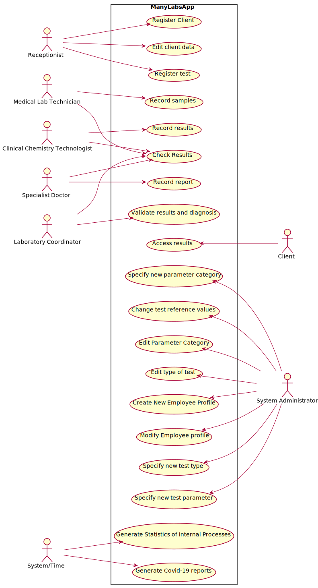

# Use Case Diagram (UCD)

**In the scope of this project, there is a direct relationship of _1 to 1_ between Use Cases (UC) and User Stories (US).**

However, be aware, this is a pedagogical simplification. On further projects and curricular units might also exist _1 to N **and/or** N to 1 relationships between US and UC.

**Insert below the Use Case Diagram in a SVG format**

**For each UC/US, it must be provided evidences of applying main activities of the software development process (requirements, analysis, design, tests and code). Gather those evidences on a separate file for each UC/US and set up a link as suggested below.**

# Use Cases / User Stories
| UC/US  | Description                                                            |  User Story Description                                              |
|:----|:------------------------------------------------------------------------| :----------------------------------------------------------------------|
| US1 | [View Results](US1/US1.md)   |  As a client, I want to access the application to view the results of the tests I have performed. |
| US2 | [Update Personal Data](US2/US2.md)  |  As a client, I want to update my personal data.  |
| US3 | [Register New Client](US3/US3.md)|  As a receptionist of the laboratory, I want to register a client. |
| US4 | [Register New Test](US4/US4.md)|  As a receptionist of the laboratory, I intend to register a test to be performed to a registered client. |
| US5 | [Record Samples](US5/US5.md)|  As a medical lab technician, I want to record the samples collected in the scope of a given test. |
| US7 | [Register New Employee](US7/US7.md)|  As an administrator, I want to register a new employee. |
| US8 | [Register New Clinical Analysis Laboratory](US8/US8.md)|  As an administrator, I want to register a new clinical analysis laboratory stating which kind of test(st) it operates. |
| US9 | [Specify New Type of Test](US9/US9.md)|  As an administrator, I want to specify a new type of test and its collecting methods. |
| US10 | [Specify New Test Parameter](US10/US10.md)|  As an administrator, I want to specify a new test parameter and categorize it. |
| US11 | [Specify New Parameter Category](US11/US11.md)|  As an administrator, I want to specify a new parameter category. |
| US12 | [Record Results](US12/US12.md)|  As a clinical chemistry technologist, I intend to record the results of a given test. |
| US13 | [Consult Client's Tests](US13/US13.md)|  As a clinical chemistry technologist, I intend to consult the historical tests performed by a particular client and to be able to check tests details/results.  |
| US14 | [Make Diagnosis and Write Report](US14/US14.md)|  As a specialist doctor, I intend to make the diagnosis and write a report for a given test. |
| US15 | [Validate Results and Report](US15/US15.md)| As a laboratory coordinator, I want to validate the work done by the clinical chemistry technologist and specialist doctor. |
| US16 | [Overview of Tests](US16/US16.md)| As a laboratory coordinator, I want to have an overview of all the tests performed by Many Labs and analyse the overall performance of the company.  |
| US17 | [Import Tests from CSV file](US17/US17.md)|  As a laboratory coordinator, I want to import clinical tests from a CSV file.  |
| US18 | [Send Covid-19 Report](US18/US18.md)|  As an Administrator I want to send the Covid-19 report to the NHS at any time. |
| US19 | [Report Covid-19 Data Automatically](US19/US19.md)|  The Many Labs company wants to send to the NHS daily reports of Covid-19 data |
| ... | ...| ...|
