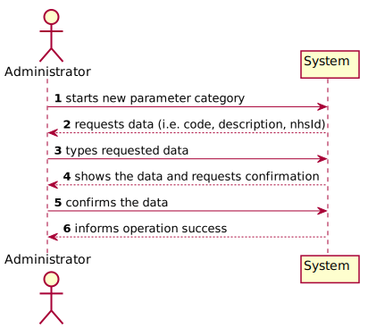
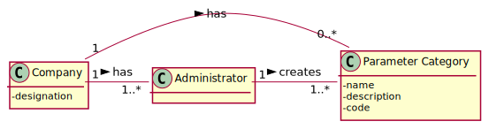
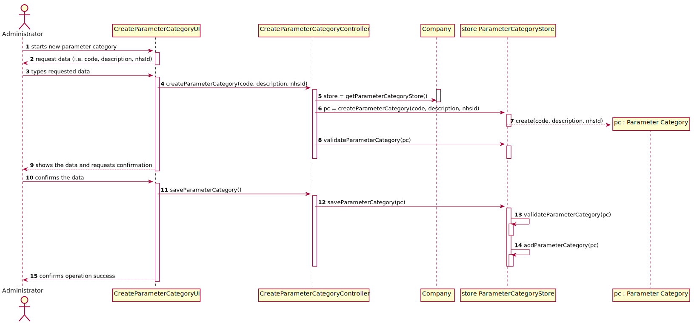
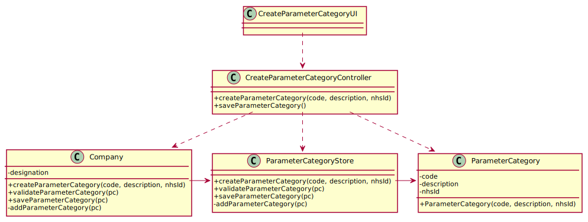

# US 011 - Specify New Parameter Category

## 1. Requirements Engineering

*In this section, it is suggested to capture the requirement description and specifications as provided by the client as well as any further clarification on it. It is also suggested to capture the requirements acceptance criteria and existing dependencies to other requirements. At last, identfy the involved input and output data and depicted an Actor-System interaction in order to fulfill the requirement.*

### 1.1. User Story Description

*As an administrator, I want to specify a new parameter category.*

### 1.2. Customer Specifications and Clarifications 

From the Specifications Document:  
* “Blood tests are frequently characterized by measuring several parameters which for presentation/reporting purposes are organized
by categories. For example, parameters such as the number of Red Blood Cells (RBC), White Blood Cells (RBC) and Platelets (PLT) are
usually presented under the blood count (Hemogram) category.”  
* “Regardless, such tests rely on measuring one or more parameters that can be grouped/organized by categories.”  

From the client clarifications:  
**Q:** What are the data that characterize a parameter category?  
**A:** Simply consider a code, a description and an NHS identifier 

**Q:** What are the information related to a Parameter Category?  
**A:** Each category has a name and a unique code. There are no subcategories.  

### 1.3. Acceptance Criteria

* AC1: Code must be unique having 4 to 8 chars  
* AC2: Description cannot be empty and has, at maximum, 40 chars
* AC3: NHS identifier is not mandatory

### 1.4. Found out Dependencies

No dependencies were found.

### 1.5 Input and Output Data

*Identity here the data to be inputted by the system actor as well as the output data that the system have/needs to present in order to properly support the actor actions. Regarding the inputted data, it is suggested to distinguish between typed data and selected data (e.g. from a list)*

* Input Data  
	- Typed data: name, code and description.
	- Selected data: (none)  
* Output Data  
	- (In)Sucess of the operation  

### 1.6. System Sequence Diagram (SSD)

*Insert here a SSD depicting the envisioned Actor-System interactions and throughout which data is inputted and outputted to fulfill the requirement. All interactions must be numbered.*

### 1.7 Other Relevant Remarks

*Use this section to capture other relevant information that is related with this US such as (i) special requirements ; (ii) data and/or technology variations; (iii) how often this US is held.* 

## 2. OO Analysis

### 2.1. Relevant Domain Model Excerpt 
*In this section, it is suggested to present an excerpt of the domain model that is seen as relevant to fulfill this requirement.* 

### 2.2. Other Remarks

*Use this section to capture some aditional notes/remarks that must be taken into consideration into the design activity. In some case, it might be usefull to add other analysis artifacts (e.g. activity or state diagrams).* 

## 3. Design - User Story Realization 

### 3.1. Rationale

**The rationale grounds on the SSD interactions and the identified input/output data.**

| Interaction ID | Question: Which class is responsible for... | Answer  | Justification (with patterns)  |
|:-------------  |:--------------------- |:------------|:---------------------------- |
| Step 1: register new client  | ...instantiating a new Parameter Category? | ParameterCategoryStore |  Creator: R1/2 && Pure Fabrication  |
| Step 2: requests data (i.e. code, description, nhsId)  |	...requesting the ParameterCategory's data?	 | UI | IE: responsible for user interaction |
| Step 3: types requested data  | ...saving the input data?	|  Parameter Category   | IE: the object created in step 1 has its own data  |
| Step 4: shows the data and requests confirmation 	|...validating the data locally (e.g.: mandatory vs.non-mandatory data)? | Parameter Category | IE  |
| 	|... validating the data globally (e.g.: duplicated)? | ParameterCategoryStore | IE: knows all the ParameterCategory objects && Pure Fabrication|
| Step 5: confirms the data  |... saving the created client? | ParameterCategoryStore | IE: adopts/records all the ParameterCategory objects && Pure Fabrication |
| Step 6: informs operation success  |	...informing operations success?| UI |  IE: responsible for user interaction |              

### Systematization ##

According to the taken rationale, the conceptual classes promoted to software classes are: 

 * ParameterCategory
 * Company
 * Administrator

Other software classes (i.e. Pure Fabrication) identified: 
 * CreateParameterCategoryUI  
 * CreateParameterCategoryController

## 3.2. Sequence Diagram (SD)

*In this section, it is suggested to present an UML dynamic view stating the sequence of domain related software objects' interactions that allows to fulfill the requirement.* 

## 3.3. Class Diagram (CD)

*In this section, it is suggested to present an UML static view representing the main domain related software classes that are involved in fulfilling the requirement as well as and their relations, attributes and methods.*

# 4. Tests 

I tested two classes: the Parameter Category model class and the CreateParameterCategoryController Class. The reason for the separation was that, given that the handling of exceptions was done in the Controller class, it would be easier to test *n* different situations of invalid fields, without having to separate it into *n* test classes, because it would then print the respective message of every problem.

## 4.1 Parameter Category Model Class

**Set Up:**

    @Before
    public void setUp() throws Exception {
        ParameterCategory pc1 = new ParameterCategory("Hemogram", "Blood tests", "12345");
        ParameterCategory pc2 = new ParameterCategory("Proteins", "Analyses protein levels", "55555");
        ParameterCategory pc3 = new ParameterCategory("Hemogram", "Blood testing", "987654");
        ParameterCategory pc4 = new ParameterCategory("Thyroid", "Thyroid tests", "12345");
        ParameterCategory pc5 = new ParameterCategory("Nutrients", "Thyroid tests", "6666");
    }

**Test 1:** Check that it is not possible to create an instance of the Parameter Category class with null values. 

	@Test(expected = IllegalArgumentException.class)
		public void ensureNullIsNotAllowed() {
		ParameterCategory pc = new ParameterCategory(null, null, null);
	}

**Test 2:** Check that the equals method was working as intended.
  
    @Test
    public void testEquals() {
        boolean result1 = pc1.equals(pc2);
        boolean result2 = pc1.equals(pc3);
        boolean result3 = pc1.equals(pc4);
        boolean result4 = pc4.equals(pc5);

        assertFalse(result1);
        assertTrue(result2);
        assertTrue(result3);
        assertFalse(result4);
    }

**Test 2:** Check that the get method was working as intended.

    @Test
    public void getName() {
        String expectedName = "Hemogram";
        String name = pc1.getName();
        assertEquals(expectedName, name);
    }

This was replicated for each attribute.

## 4.2 CreateParameterCategoryController Class

*This class handled the exceptions in case some of the fields did not fulfill the requirements.*

**Set Up:**

    @Before
    public void setUp() throws Exception {
        controller = new CreateParameterCategoryController();
        //Codes
        code1 = "12345";        //Valid
        code2 = "12";           //Too short
        code3 = "123456789";    //Too long
        code4 = "123?3";        //Invalid characters
        code5 = null;           //Null
    }

**Test 1:** Check that it is not possible to create an instance of the ParameterCategory class with invalid code values, since it had to be between 4 to 8 alphanumerical characters;

    @Test
    public void createParameterCategoryInvalidCode() {
        boolean result1 = controller.createParameterCategory(name1, description1, code2);
        boolean result2 = controller.createParameterCategory(name1, description1, code3);
        boolean result3 = controller.createParameterCategory(name1, description1, code4);
        boolean result4 = controller.createParameterCategory(name1, description1, code5);
        assertFalse(result1);
        assertFalse(result2);
        assertFalse(result3);
        assertFalse(result4);
    }

This was replicated for each attribute.

## 4.3 ParameterCategoryStore Class

**Test 1:** Check that it is not possible to add a Parameter Category with the same name in the store.

    @Test
    public void addParameterCategorySameName() {
        pc1 = new ParameterCategory("Hemogram", "Blood tests", "12345");
        parameterCategoryStore.addParameterCategory(pc1);
        pc2 = new ParameterCategory("Hemogram", "Blood testing", "987654");
        boolean result = parameterCategoryStore.addParameterCategory(pc2);
        assertFalse(result);
    }

This was replicated for the code.

# 5. Construction (Implementation)

## 5.1 ParameterCategory Class

This class holds the necessary attributes for the Parameter Categories (i.e. name, description and code) and the respective validations. In case some of the attributes is invalid (either when creating the instance or modifying it), the validation method will throw an exception that will be handled in the CreateParameterCategoryController.

## 5.2 CreateParameterCategoryUI Class

This class is responsible for the input and output of data for the Parameter Category. In case the category is successfully created (i.e. none of the validity exceptions was thrown), it shows the receptionist all the information for confirmation. Once confirmed, it outputs the success of the operation.

## 5.3 CreateParameterCategoryController Class

This class uses the app singleton to get the company and then the associated Parameter Category store, to then act upon it, by creating and adding parameter categories.

# 6. Integration and Demo 

In the ParameterCategoryStore I had to implement the methods getParameterCategory(int i) and showParameterCategoryList(). The former returns a given parameter category according to the index that it receives, and the latter prints all the Parameter Categories that the company has. This was done in order to integrate with the feature of registering a type a test (US9) since, for now, the test types are being created using the ParameterCategoryStore (instead of a DTO as it shall be in the future).

# 7. Observations

In Sprint B I was able to implement the Model View Controller solution, implementing a ClientStore to handle all the clients of the system, the Controller to handle all operations and the UI layer just for input and output of data.

**Some other things I want to develop:**

* A ParameterCategoryDTO and Mapper in order to be able to print the Parameter Categories when registering a type of test and select the ones that are to be associated with that test.

