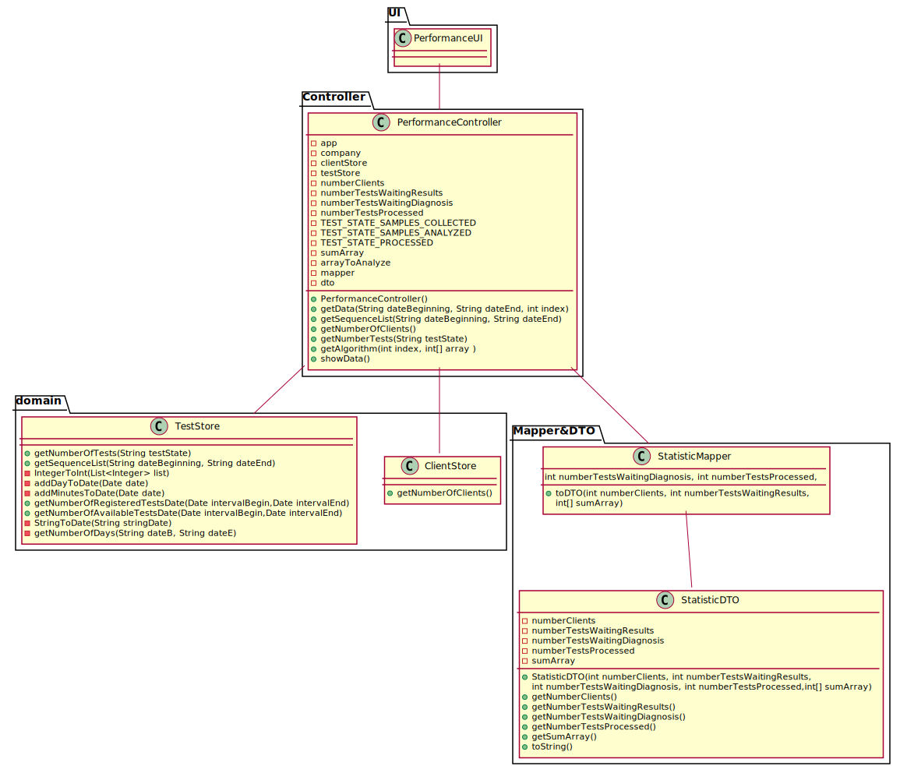

# US 016 - Overview of Tests

## 1. Requirements Engineering

*In this section, it is suggested to capture the requirement description and specifications as provided by the client as well as any further clarification on it. It is also suggested to capture the requirements acceptance criteria and existing dependencies to other requirements. At last, identfy the involved input and output data and depicted an Actor-System interaction in order to fulfill the requirement.*

### 1.1. User Story Description

*As a laboratory coordinator, I want to have an overview of all the tests performed by Many Labs and analyse the overall performance of the company (for instance, check the sub-intervals in which there were more samples waiting for the result). To facilitate overall analysis, the application should also display statistics and graphs.*

### 1.2. Customer Specifications and Clarifications 

*Insert here any related specification and/or clarification provided by the client together with **your interpretation**. When possible, provide a link to such specifications/clarifications.*

**Clarifications from the document**

Moreover, Many Labs is a company that needs to be continuously evaluating and improving its
internal processes to achieve excellence and to beat the competition. Therefore, the company wants
to decrease the number of tests waiting for its result. To evaluate this, it proceeds as following: for
any interval of time, for example one week (6 working days with 12 working hours per day), the
difference between the number of new tests and the number of results available to the client during
each half an hour period is computed. In that case, a list with 144 integers is obtained, where a
positive integer means that in such half an hour more tests were processed than results were
obtained, and a negative integer means the opposite. Now, the problem consists in determining what
the contiguous subsequence of the initial sequence is, whose sum of their entries is maximum. This
will show the time interval, in such week, when the company was less effective in responding. So,
the application should implement a brute-force algorithm (an algorithm which examines each
subsequence) to determine the contiguous subsequence with maximum sum, for any interval of time
registered. The implemented algorithm should be analysed in terms of its worst-case time 
complexity, and it should be compared to a provided benchmark algorithm. The algorithm to be
used by the application must be defined through a configuration file.
The complexity analysis must be accompanied by the observation of the execution time of the
algorithms for inputs of variable size in order to observe the asymptotic behaviour. The time
complexity analysis of the algorithms should be properly documented in the application user
manual (in the annexes) that must be delivered with the application.

**Clarifications from the client**

Q1: Should the interval of time considered for the evaluation be asked to the Laboratory Coordinator?
A: Yes.

Q1.2: How should we ask him the interval of time to be considered? Should we ask him to type a number of days? A number of weeks? Should we give general options like: last week, last month..., for him to select from?
Q1.2.1: In case the Laboratory Coordinator chooses, for example, one week, should we consider the last 7 days, or should we consider, for example, the data from monday to sunday?
A: The laboratory coordinator should introduce two dates that define an interval, the beginning date and the end date. This interval will be used to find the contiguous subsequence with maximum sum.

In the User Story Description, it reads: "As a laboratory coordinator, I want to have an overview of all the tests performed by Many Labs[...]".
Q2: What is the meaning of "overview" here? Should the laboratory coordinator see the number of tests waiting for samples, the number of tests waiting for results, the number of tests waiting for diagnoses... Or should he see the information available for each one of the tests in the application?
A: The laboratory coordinator should be able to check the number of clients, the number of tests waiting for results, the number of tests waiting for diagnosis and the total number of tests processed in the laboratory in each day, week, month and year. Moreover, the laboratory coordinator should be able to check the contiguous subsequence with maximum sum.

Q:When referring to "the application should also display statistics and graphs" is it up to the team to decide which API or resource should be used to generate graphs and statistics, or do you prefer something specific?
A: With JavaFX you can draw high quality graphs and there is no need to use other tools.

Q1: After the Laboratory Coordinator types the requested data and views the analysis of the company performance, should he be able to re-type different data and view the results for a different interval of time and/or algorithm? To make the re-type of the data easier, should there be a "clear" button, that is responsible for clearing the text fields for data entry?
A: The laboratory coordinator should be able to explore different parameter values (settings) and check the results. Each team should prepare a simple and intuitive interface that requires a minimum number of interactions with the user.

Q1. You said in this Q&A https://moodle.isep.ipp.pt/mod/forum/discuss.php?d=8831, that the laboratory coordinator should define an interval, the beginning date and the end date.
Q1.1. Can we assume that every day in the interval defined by the coordinator is a working day with 12 working hours each?
A: Yes.

Q1.2. If Saturday or Sunday are in the interval should we skip them or count them also as working days?
A: Sunday is not a working day. All the other days of the week are working days.

"For example one week (6 working days with 12 working hours)"
Q2. In this case, is there any specifc hour to start filling the 144 integers list?
A: A working day is from 8h00 to 20h00.

Q: On the project description is written that "The algorithm to be used by the application must be defined through a configuration file", but on the requirements is written that "the laboratory coordinator should have the ability to dynamically select the algorithm to be applied from the ones available on the system". Should we discard the configuration file and add an option on th program to select one of the available algorithms?
A: Developing an application, like the one we are developing during the Integrative Project, is a dynamic process and the best teams are those who are prepared to react to change quickly. Moreover, the latest client requests/requirements are those that should be considered. Typically, a client updates the requirements throughout the project development.
Please consider the requirements introduced at the beginning of Sprint D. The laboratory coordinator should have the ability to dynamically select the algorithm to be applied from the ones available on the system (either the benchmark algorithm provided in moodle or the brute-force algorithm to be developed by each team).

Q: Does the laboratory coordinator also select the amount of working hours per day? Or should we just consider it as 12 working hours/day?
A: The lab coordinator does not select the amount of working hours per day. Please consider 12 working hours per day.

Q: Regarding US16, when the laboratory coordinator "analyses the overall performance of the company", is the analysis purely looking at the results? Or should he write any type of report based on the results for the interval he is seeing?
A: You should only identify the time interval where there was a delay in the response (the maximum subsequence).

Q1:The elements used in the algorithm refer to a half-hour interval?
A. Yes.

Q1.1: How do we obtain the number to be used in the algorithm do we subtract tests that got a result in that interval and the tests registered?
A: Yes.

Q: When you say tests waiting results are you referring to tests with samples collected but not analyzed yet? If so, and considering the csv file does not have an explicit date for when the sample is collected, which date should we use?
A: You should use the test registration date (Test_Reg_DateHour).

Q: What is the total number of tests processed in the laboratory? Is it the number of tests that were given results in that time span or is it the number of tests that were validated in that time span?
A: The total number of tests processed in the laboratory is the total number of tests that were validated by the laboratory coordinator.
In a previous answer I asked: "The laboratory coordinator should be able to check the number of clients, the number of tests waiting for results, the number of tests waiting for diagnosis and the total number of tests processed in the laboratory in each day, week, month and year. "
I asked these statistics for a given interval that should be selected by the user. Moreover, the application should also show to the laboratory coordinator the total number of clients and the total number of validated tests that exist in the system.

Q1: (US16) What are the statistics that require a graph, could you specify, please.
A: In a previous post I asked: "The laboratory coordinator should be able to check the number of clients, the number of tests waiting for results, the number of tests waiting for diagnosis and the total number of tests processed (tests validated) in the laboratory in each day, week, month and year. The system should show these statistics for a given interval that should be selected/defined by the user".
The application should present these statistics using four graphs/charts, one for each time resolution (day, week, month and year).

In a previous post I also said: "Moreover, the application should also show to the laboratory coordinator the total number of clients and the total number of validated tests that exist in the system.". There is no need to show these information using a graph/chart.

Q2: (US 17) Should we write some kind of report or should we just leave the report field empty and simply add the date?
A: Leave empty and simply add the date.

### 1.3. Acceptance Criteria

*Insert here the client acceptance criteria.*

Acceptance Criteria: While evaluating the performance the laboratory
coordinator should have the ability to dynamically select the algorithm to be
applied from the ones available on the system (the benchmark algorithm provided
in moodle and the brute-force algorithm to be developed). Support for easily
adding other similar algorithms is required.

### 1.4. Found out Dependencies
US3: As a receptionist of the laboratory, I want to register a client.
US4: As a receptionist of the laboratory, I intend to register a test to be performed to a
registered client.
US5: As a medical lab technician, I want to record the samples collected in the scope of a
given test.
US12: As a clinical chemistry technologist, I intend to record the results of a given test.
US14: As a specialist doctor, I intend to make the diagnosis and write a report for a given
test.

*Identify here any found out dependency to other US and/or requirements.*

### 1.5 Input and Output Data

*Identity here the data to be inputted by the system actor as well as the output data that the system have/needs to present in order to properly support the actor actions. Regarding the inputted data, it is suggested to distinguish between typed data and selected data (e.g. from a list)*

**Input data**
    **Typed**
    -Two dates (beggining and end of the period interval to analyse)

**Output data**
    -number of clients
    -number of tests waiting for results
    -number of tests waiting for diagnosis
    -number of tests processed
    -contiguous subsequence with maximum sum

### 1.6. System Sequence Diagram (SSD)

*Insert here a SSD depicting the envisioned Actor-System interactions and throughout which data is inputted and outputted to fulfill the requirement. All interactions must be numbered.*

### 1.7 Other Relevant Remarks

*Use this section to capture other relevant information that is related with this US such as (i) special requirements ; (ii) data and/or technology variations; (iii) how often this US is held.* 

## 2. OO Analysis

### 2.1. Relevant Domain Model Excerpt 
*In this section, it is suggested to present an excerpt of the domain model that is seen as relevant to fulfill this requirement.* 

### 2.2. Other Remarks

*Use this section to capture some aditional notes/remarks that must be taken into consideration into the design activity. In some case, it might be usefull to add other analysis artifacts (e.g. activity or state diagrams).* 

## 3. Design - User Story Realization 

### 3.1. Rationale

**The rationale grounds on the SSD interactions and the identified input/output data.**

| Interaction ID | Question: Which class is responsible for... | Answer  | Justification (with patterns)  |
|:-------------  |:--------------------- |:------------|:---------------------------- |
| Step 1 Ask to analyse the performance 		 | 	Obtaining all the data necessary?						 |  TestStore           | Information Expert: Knows its own content                             |
| Step 2 Request Data 		 |	asking for the input data?						 |  UI           |                              |
| Step 3 Types Data 		 |	typing the input data?						 |   LabCoord          |  Information Expert: Knows the input data                            |
| Step 4 Shows Results 		 |	shows the output data?						 |   UI          |  Information Expert: User-System interface                            |
             

### Systematization ##

According to the taken rationale, the conceptual classes promoted to software classes are: 

* Comapny
* LabCord
* TestStore
* ClientStore

Other software classes (i.e. Pure Fabrication) identified: 
 * PerformanceUI  
 * PerformanceController

## 3.2. Sequence Diagram (SD)

*In this section, it is suggested to present an UML dynamic view stating the sequence of domain related software objects' interactions that allows to fulfill the requirement.* 

## 3.3. Class Diagram (CD)

*In this section, it is suggested to present an UML static view representing the main domain related software classes that are involved in fulfilling the requirement as well as and their relations, attributes and methods.*

# 4. Tests 
*In this section, it is suggested to systematize how the tests were designed to allow a correct measurement of requirements fulfilling.* 

**_DO NOT COPY ALL DEVELOPED TESTS HERE_**

**Test 1:** Check that the DTO is being created correctly. 

	@Test
    public void toDTO() {
        StatisticDTO newDTO=mapper.toDTO(numberofClients,numberTestsWaitingResults,numberTestsWaitingDiagnosis,numberTestsProcessed,sumArray);
        StatisticDTO newDTO1=mapper.toDTO(2,numberTestsWaitingResults,numberTestsWaitingDiagnosis,numberTestsProcessed,sumArray);
        String dtoString=dto.toString();
        String newDTOString=newDTO.toString();
        assertEquals(newDTOString.equals(dtoString),true);
        assertEquals(newDTO1.toString().equals(dtoString),false);
    }

*It is also recommended to organize this content by subsections.* 

# 5. Construction (Implementation)

*In this section, it is suggested to provide, if necessary, some evidence that the construction/implementation is in accordance with the previously carried out design. Furthermore, it is recommeded to mention/describe the existence of other relevant (e.g. configuration) files and highlight relevant commits.*

In this story the Laboratory Coordinator asks to analyse the performance of the company, then the UI will open and will ask the laboratory coordinator for the input data. After typing the input data and click on the button to send data, the UI will send this data to the Controller. The Controller will call the ClientStore to see how many Clients were created, and will call the TestStore to identify how many Tests waiting for results, Tests waiting for diagnosis, and the number of Tests processed, and will also call an Algorithm class (either benchmark or brute force, depending on what the user chose). Then this data will be sent to a DTO. The DTO will be returned to the UI, where its data will be displayed for the user to see.

*It is also recommended to organize this content by subsections.* 

# 6. Integration and Demo 

*In this section, it is suggested to describe the efforts made to integrate this functionality with the other features of the system.*

To integrate this story it is necessary both Client creation and Test creation. After having the previous functionalities, the user would type the input data, this would tell the controller to fetch from the ClientStore's store and the TestsStore's store the requested data, and would call also an algorithm class that would return a subsequence of max sum of that array. This data would all be sent to a DTO that would be displayed in the UI

# 7. Observations

*In this section, it is suggested to present a critical perspective on the developed work, pointing, for example, to other alternatives and or future related work.*

In this user story i think i did an average work or even below average, my user story has some critical flaws, like not following some of the Client's requests and having a bad UI look and feeling. This was because my group only has 3 people programming and we had to make multiple user stories this sprint, and thus making our time for each user story, very short. 

