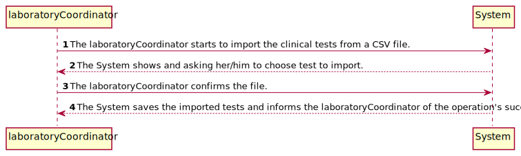
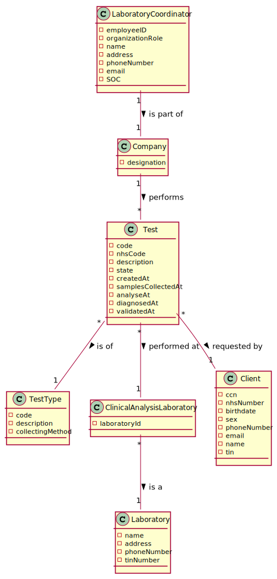
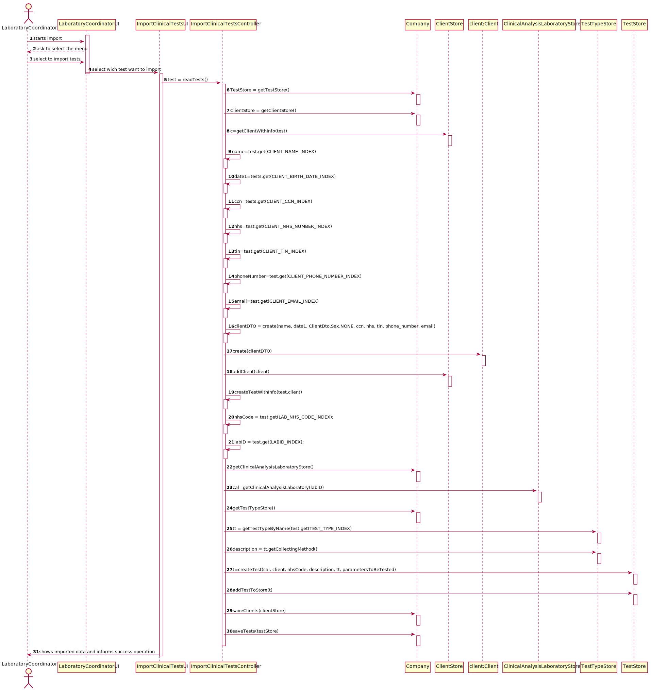
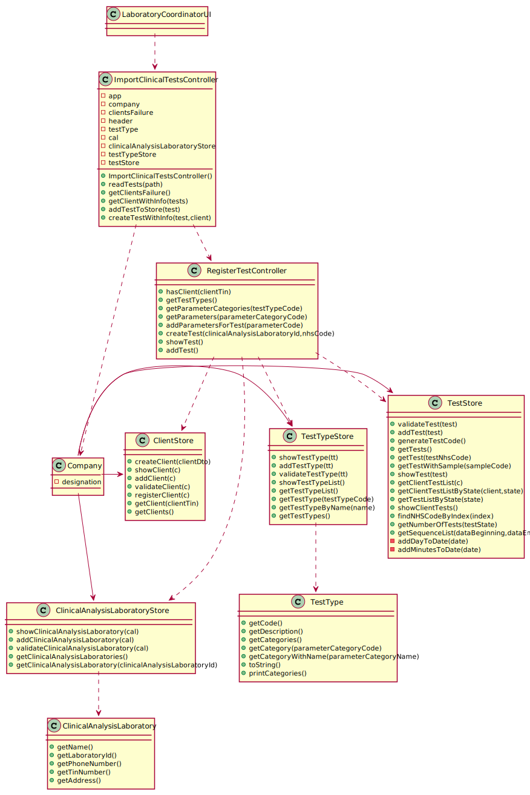

# US 017 - Import Tests from CSV file

## 1. Requirements Engineering

*In this section, it is suggested to capture the requirement description and specifications as provided by the client as well as any further clarification on it. It is also suggested to capture the requirements acceptance criteria and existing dependencies to other requirements. At last, identfy the involved input and output data and depicted an Actor-System interaction in order to fulfill the requirement.*

### 1.1. User Story Description

*As a laboratory coordinator, I want to import clinical tests from a CSV file.*

### 1.2. Customer Specifications and Clarifications 

**From the client clarifications:**

>- **Q**: When loading a .csv file after another .csv has been loaded beforehand, do we keep the tests that were loaded previously or do we replace them with the new tests being loaded from the new .csv?
>- **A**: The tests should not be deleted after being loaded.

>- **Q**: when importing a test and associating it to the client, should the client exist beforehand or should we import the client with the information given on the CSV file?
>- **A**: Different from what I asked for the other entities (like the lab), when importing the CSV data, if the client does not exist in the system, then the client should be created using the data available in the CSV file.

>- **Q**: In the CSV, there is a parameter category that has 11 characters (Cholesterol). How do you suggest we should proceed?
>- **A**: Please modify your application to accept category names with a maximum of 15 characters.

>- **Q**: Should we write some kind of report or should we just leave the report field empty and simply add the date?
>- **A**: Leave empty and simply add the date.

>- **Q**: In us9 you said in relation to the test types that "The code is not automatically generated". However, if we are creating a new test type, because of the excel file, for example a urine test type, we don't have any code for that test type in the excel file, in that case do we create it automatically or how do we do it?
>- **A**: In a previous post I already gave an answer to this question. If a urine test type is available in the CSV file, each team should create this type of test in the system before loading the data.

>- **Q**: Previously you said that “we can have more categories and parameters for each type of test.” regarding the format of the .csv files. Then, my understanding is that between the TestType and Test_Reg_DateHour columns, the number of columns is dynamic, correct? Could we end up seeing a Category_3, a Category_4, and so on?
>- **A**: Yes.

>- **Q**: On the same issue, if there was, let’s say, a Urine type of test, would we also see some of its own categories and parameters reflected on the .csv file, as we see, for instance, N/A COVID categories on .csv files with only BLOOD type of tests?
>- **A**: Yes.

>- **Q**: Up until now, we haven’t had any need to assign an address to a client. Seeing that there is now an Address column, that for us is somewhat left unused, would you advise us to add it as an attribute to the Client entity?
>- **A**: Yes. The address should have no more than 90 characters. Please consider the address of the Employee to have the same format that I am suggesting now for the client's address. In the beginning of the project I said that the address of the Employee should have no more than 30 characters but with this size we can not write a normal UK address.

>- **Q**: If some kind of data is wrong, what should happen should we just ignore the line where it is located
>- **A**: The application should not load tests that have incorrect attribute values. The application should identify the tests that have incorrect values and it should continue loading all valid tests that exist in the file. A message should be sent to the console to identify the tests/lines that have incorrect values.

>- **Q**: Should we show the data that the laboratory coordinator is importing?
>- **A**: Yes, it should show all the data that was imported at that time.

>- **Q**: if a labID on the CSV file isn't found on the system, should we consider it "invalid data"?
>- **A**: Yes. To import tests of any laboratory (with a given Lab_ID), it is required that a laboratory having the given Lab_ID exists in the system.
Therefore, if you want to import data from a given laboratory, you should use the application to create that laboratory in the system. Then you should import the data.
When creating a laboratory in the system, you should use the given Lab_ID (available in the CSV file) and define the other attributes using valid data. In this project, we are NOT going to import data from laboratories (or other entities) to reduce the amount of hours required to develop and deliver a working application to the client. What I say in this message is valid for the laboratories and for other entities that appear in the CSV files

### 1.3. Acceptance Criteria

**AC1**: If the file contains invalid data (e.g., a parameter not defined in the system), that data should not be load into the system. An exception should be thrown
**AC2**: Category names with a maximum of 15 characters
**AC3**: The address should have no more than 90 characters.

### 1.4. Found out Dependencies

**US7** - laboratory coordinator must be registered in the system

### 1.5 Input and Output Data

* Input Data  
	- Selected data: CSV File
* Output Data  
	- (In)Sucess of the operation

### 1.6. System Sequence Diagram (SSD)

*Insert here a SSD depicting the envisioned Actor-System interactions and throughout which data is inputted and outputted to fulfill the requirement. All interactions must be numbered.*

### 1.7 Other Relevant Remarks

*Use this section to capture other relevant information that is related with this US such as (i) special requirements ; (ii) data and/or technology variations; (iii) how often this US is held.* 

## 2. OO Analysis

### 2.1. Relevant Domain Model Excerpt 
*In this section, it is suggested to present an excerpt of the domain model that is seen as relevant to fulfill this requirement.* 

### 2.2. Other Remarks

*Use this section to capture some aditional notes/remarks that must be taken into consideration into the design activity. In some case, it might be usefull to add other analysis artifacts (e.g. activity or state diagrams).* 

## 3. Design - User Story Realization 

### 3.1. Rationale

**The rationale grounds on the SSD interactions and the identified input/output data.**

| Interaction ID | Question: Which class is responsible for... | Answer  | Justification (with patterns)  |
|:-------------  |:--------------------- |:------------|:---------------------------- |
| Step 1:...interacting with the actor?| LaboratoryCoordinatorUI | **IE:** Responsible for user interaction |... coordinating the US? | ImportClinicalTestsController | **Controller**  
| Step 2:...interacting with the actor? | ImportClinicalTestsUI | **IE:** Responsible for user interaction |... coordinating the US? | ImportClinicalTestsController | **Controller**
| Step 3:...load choosed csv file? | ImportClinicalTestsController | 
| Step 4:...have the information about clients? | ClientStore | Creator (R1) and HC+LC (Pure Fabrication): By the application of the Creator (R1) it would be the "Company". But, by applying HC + LC to the "Company", this delegates that responsibility to the "ClientStore"|
| Step 5:...add client? | ClientStore | knows data clients. |
| Step 6:...have the information about ClinicalAnalysisLaboratory | ClinicalAnalysisLaboratoryStore | Creator (R1) and HC+LC (Pure Fabrication): By the application of the Creator (R1) it would be the "Company". But, by applying HC + LC to the "Company", this delegates that responsibility to the "ClinicalAnalysisLaboratoryStore"|
| Step 7:...know about testType data? | TestTypeStore | knows testType data. |
| Step 8:...create and add test? | TestStore | Creator (R1) and HC+LC (Pure Fabrication): By the application of the Creator (R1) it would be the "Company". But, by applying HC + LC to the "Company", this delegates that responsibility to the "TestStore"|
| Step 9:...save client and test? | Company | Serialization object state into a format that can be stored or transmitted and reconstructed later.
| Step 10:...informing operations success? | ImportClinicalTestsUI | Responsible for user interaction | shows information.

### Systematization ##

According to the taken rationale, the conceptual classes promoted to software classes are: 

 * Company
 * TestType
 * Test
 * ClinicalAnalysisLaboratory

Other software classes (i.e. Pure Fabrication) identified: 
 * LaboratoryCoordinatorUI 
 * ImportClinicalTestsUI
 * ImportClinicalTestsController
 * RegisterTestController
 * ClientStore
 * TestTypeStore
 * TestStore
 * ClinicalAnalysisLaboratoryStore
 * ClientDTO

## 3.2. Sequence Diagram (SD)

*In this section, it is suggested to present an UML dynamic view stating the sequence of domain related software objects' interactions that allows to fulfill the requirement.* 

## 3.3. Class Diagram (CD)

*In this section, it is suggested to present an UML static view representing the main domain related software classes that are involved in fulfilling the requirement as well as and their relations, attributes and methods.*

# 4. Tests 
*In this section, it is suggested to systematize how the tests were designed to allow a correct measurement of requirements fulfilling.* 

## 4.1 ImportClinicalTestsControllerTest Class

**Test 1:** Check if have some invalid data.

## 4.2 RegisterTestControllerTest Class

**Test 1:** Check if client exists.

**Test 2:** Check if test added.

**Test 3:** Check if test created

**Test 4:** Check Parameters

**Test 5:** Check ParameterCategories

**Test 6:** Check TestTypes

**_DO NOT COPY ALL DEVELOPED TESTS HERE_**

**Test 1:** Check that it is not possible to create an instance of the Example class with null values. 

	@Test(expected = IllegalArgumentException.class)
		public void ensureNullIsNotAllowed() {
		Exemplo instance = new Exemplo(null, null);
	}

*It is also recommended to organize this content by subsections.* 

# 5. Construction (Implementation)

## 5.1 ImportClinicalTestsUI Class
this class is responisble for the input and output of data, It begins by creating an instance of the ImportClinicalTestsController, which will be responsible for the interaction with the domain layer.  Then UI ask laboratory coordinator wich test he wants to import. When the tests are all saved the UI shows the complete information to laboratory coordinator and UI informs the operation success.

## 5.2 Test Class
This class holds all the necessary attributes for the tests (i.e., an internal code, an NHS code, a description describing the collection method, relevant dates) and also contains objects necessary to all features relating to the tests.

## 5.3 TestType Class
This class holds the necessary attributes for the testTypes.

## 5.4 TestStore Class
Although the Company class is the one that should know the Tests it performs, it delegates its storage to the TestStore by Pure Fabrication, to reduce its complexity.

## 5.5 ClinicalAnalysisLaboratoryStore Class
Although the Company class is the one that should know the clinical analysis laboratories, it delegates to the ClinicalAnalysisLaboratoryStore by Pure Fabrication, to reduce its complexity.
 
## 5.6 ClinicalAnalysisLaboratory Class
This class holds all the necessary attributes for the ClinicalAnalysisLaboratory.

## 5.7 ClientStore Class
Although the Company class is the one that should know the Clients, it delegates its storage to the ClientStore by Pure Fabrication, to reduce its complexity.

# 6. Integration and Demo 

*In this section, it is suggested to describe the efforts made to integrate this functionality with the other features of the system.*

# 7. Observations

*In this section, it is suggested to present a critical perspective on the developed work, pointing, for example, to other alternatives and or future related work.*