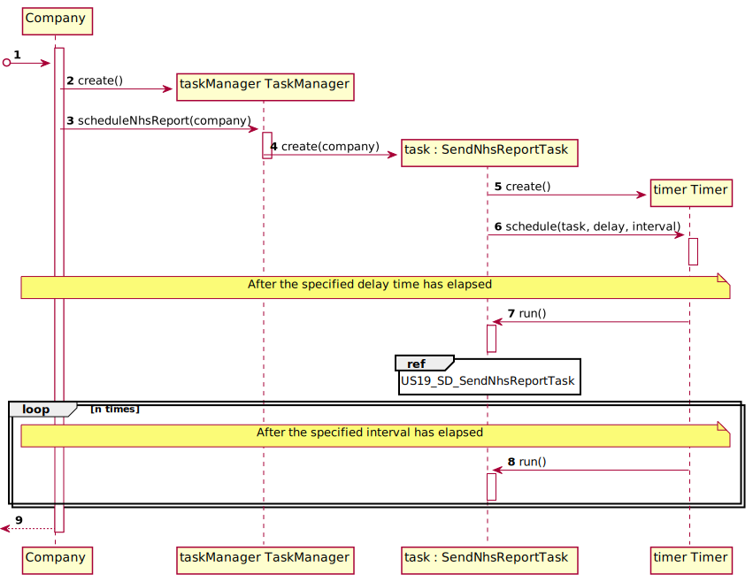
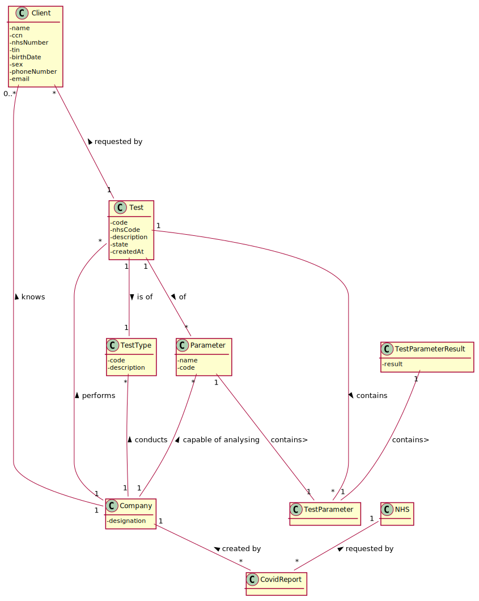

# US 019 - Report Covid-19 Data Automatically

## 1. Requirements Engineering

### 1.1. User Story Description

*The Many Labs company wants to send to the NHS daily reports of Covid-19 data, including the number of observed values and estimated values. Reports should be generated automatically with historical data and must be sent every day at 6:00 am.*

### 1.2. Customer Specifications and Clarifications 

**From the specifications document:**

- "Considering that Many Labs has the exclusivity to perform Covid-19 tests, and that the contract
with the NHS in England requires Many Labs to summarize and report Covid-19 data, the company
needs to: identify the number of Covid-19 tests performed, identify all positive results to Covid-19
tests, report the total number of Covid-19 cases per day, per week and per month of the year, and
send the forecasts for these same time horizons (the number of Covid-19 cases for the following
day, next week and next month). The company is also required to generate daily (automatic) reports
with all the information demanded by the NHS and should send them to the NHS using their API.
To make the predictions, the NHS contract defines that a linear regression algorithm should be used.
The NHS required that both simple linear and multiple linear regression algorithms should be
evaluated to select the best model. The accuracy of the prediction models should be analysed and
documented in the application user manual (in the annexes) that must be delivered with the
application. The algorithm to be used by the application must be defined through a configuration
file.""

**From the client clarifications:**
  
>- **Question:** Will it be given a Multiple Linear Regression Class to work, or should it be developed by the groups?
>- **Answer:** The Multiple Linear Regression Class should be developed by each team. In moodle I made available a Java file with Simple Linear Regression. The teams should not use libraries or other external modules to implement linear regression.

 

>- **Question:** As the report is generated automatically, should the system generate a notification that the report was sent?
>- **Answer:** The application should write the event into a log file.

 

>- **Question:** Regarding US18 and US19, it is only one report containing all the tests performed by Many Labs to be sent each time, correct? Or is it one report per laboratory, for example? Or other option?
>- **Answer:** The report should contain all the tests made by Many Labs.

 

>- **Question:** In US19, in Sprint D Requirements, it says "The report should include day and week (observed and estimated) values..." and also "Reports...must be sent every day at 6:00 am". As the Report is to be automatically sent very early in the morning, do you wish the report to have the data concerning the day before and the last week starting at the day before?
>- **Answer:** The format of the report should follow the report example that is available in moodle.

 

>- **Question:** Should the report contain the data of all the tests with results (with or without report, with or without validation) or contain only the validated tests? (Or other option?)
>- **Answer:** The NHS Covid report should include statistics computed only from validated tests.

 

>- **Question:** Which significance level should we use for the hypothesis tests?
>- **Answer:** The application should allow the user to choose the significance level.

 

>- **Question:** How it is supposed to evaluate the performance of the Simple Linear Regression for the different independent variables?
>- **Answer:** You should apply anova and from the best r2 you can conclude which fits better.

 

>- **Question:** If the admin selects the multilinear regression he/she can select more than one independent variable. Should he select from a checklist the ones that he/she want? If so, what are the supposed independent variables we need to include in the checklist?
>- **Answer:** From Sprint D requirements we also get "Administrator should be able to choose the independent variable to use with the simple linear regression model (either the number of tests realized or the mean age)."
To apply MLR you need two independent variables - daily number tests and mean age person tested daily. Also you need the same records per week.

 

>- **Question:** What about US19? Is the significance level, for example, defined in the configuration file?
>- **Question:** Is the same logic applied to the confidence intervals to be on the table? (In US18, the user chooses the confidence levels? What about US19?)
>- **Answer:** Yes the user could be choose the significance level for hip t and confidence level for IC.

 

>- **Question:** Also, should we ask for the prevision interval level or should we just use 95% like it's shown in the example report?
>- **Answer:** The user should introduce the confidence level value.

 

>- **Question:** If on a certain day or week there aren't any Covid 19 tests realized and therefore no clients, should we consider the mean age to be 0?
>- **Answer:** Yes, you should consider the mean age to be zero. Sundays should not be considered in your analysis.

 

>- **Question:** Should the reports sent to the NHS be saved in the app, or are they just sent?
>- **Answer:**  There is no need to save the report in the app.

 

### 1.3. Acceptance Criteria

* **AC01:** The application should write the event into a log file.
* **AC02:** The interval of dates to fit the regression model and the number of historical points (number of days and number of weeks) must be defined through a configuration file.
* **AC03:** The Linear Regression model to use should be defined through a configuration file.
* **AC04:** The system should send the report using the NHS API.
* **AC05:** The NHS Covid report should include statistics computed only from validated tests.
* **AC06:** The report should contain all the tests made by Many Labs.
* **AC07:** The report should be sent every morning at 6 am.

### 1.4. Found out Dependencies

* **US4:** Company must have registered tests.
* **US12:** The tests need to have results.
* **US14/15:** The tests need to be validated.
* **US17:** In a way, we depend on this user story to be able to import large quantities of clients and tests into the system.

### 1.5 Input and Output Data

**Input Data:**

* **Configuration file:**

	* Linear Regression Module Adapter Class Path
	* Historical Points
	* Data set start date
	* Data set end date
	* Hypothesis Test Alpha
	* Significance Model Alpha
	* Confidence Interval Alpha

### 1.6. System Sequence Diagram (SSD)

*Insert here a SSD depicting the envisioned Actor-System interactions and throughout which data is inputted and outputted to fulfill the requirement. All interactions must be numbered.*

### 1.7 Other Relevant Remarks

The app should use the NHS Report API provided on Moodle. It should also use Linear Regression classes implemented by us. The report is to be sent every morning at 6am.

## 2. OO Analysis

### 2.1. Relevant Domain Model Excerpt 
*In this section, it is suggested to present an excerpt of the domain model that is seen as relevant to fulfill this requirement.* 

### 2.2. Other Remarks

*Use this section to capture some aditional notes/remarks that must be taken into consideration into the design activity. In some case, it might be usefull to add other analysis artifacts (e.g. activity or state diagrams).* 

## 3. Design - User Story Realization 

### 3.1. Rationale

**The rationale grounds on the SSD interactions and the identified input/output data.**

| Interaction ID | Question: Which class is responsible for... | Answer  | Justification (with patterns)  |
|:-------------  |:--------------------- |:------------|:---------------------------- |
| Step 1  		 | ...scheduling the timer?	 | Company   |  IE: The company knows its own tasks  |
| Step 2  		 |...creating the timer	? |  SendNhsReportTask  |  IE: The task needs to know when it has to run|
| Step 3  		 |... trigger the run of the task?	|  Timer |  IE: Knows its own schedule |
| Step 4  		 |... creating the Linear Regression Model	? | SendNHSReportTask |  Creator: Responsible for setting up the task |
| Step 5  		 |...knowing the work days?	 |   Company          |    IE: Knows when it's its day off   |
| Step 6  		 |...getting the test number values?  |  TestStore           | **Creator (R1)** and **HC+LC (Pure Fabrication)**: By the application of the Creator (R1) it would be the "Company". But, by applying HC + LC to the "Company", this delegates that responsibility to the "TestTypeStore"                             |              

### Systematization ##

According to the taken rationale, the conceptual classes promoted to software classes are: 

 * Company
 * TestStore
 * LinearRegression
 * MultipleLinearRegression
 * SimpleLinearRegression
 * ModelDataSet
 * EstimatedDataSet

Other software classes (i.e. Pure Fabrication) identified: 

 * SendNhsReportTask 
 * LinearRegressionInputDTO
 * LinearRegressionOutputDTO
 * SimpleLinearRegressionAdapter
 * MultipleLinearRegressionAdapter
 * TaskManager

## 3.2. Sequence Diagram (SD)

### 3.2.1 Task Schedule

As soon as the app starts, the company sets the timer to schedule the task of sending the NHS Report.

### 3.2.2 Send NHS Report Task

### 3.2.3 Linear Regression

**Remark1:** The process of getting the Linear Regression class involves Java Reflection, using adapters that implement a Linear Regression Interface, which in turn adapt the system to the respective Linear Regression class/adaptee (Simple Linear Regression or Multiple Linear Regression)

## 3.3. Class Diagram (CD)

**Remark1:** For ease of viewing, I separated the class diagrams into three separate ones, for their different logics

## 3.3.1 Core Overview

Here it is a very broad overview of how the logic was setup, using a task and a task manager (within Tasks), the Domain classes to obtain the required information, and the DTOs for sending data and retrieving statistics from Math classes.

## 3.3.2 Domain Logic

## 3.3.3 Statistics and Report

# 4. Tests 

Unfortunately I was not able to implement tests, due to complete lack of time.

**_DO NOT COPY ALL DEVELOPED TESTS HERE_**

**Test 1:** Check that it is not possible to create an instance of the Example class with null values. 

	@Test(expected = IllegalArgumentException.class)
		public void ensureNullIsNotAllowed() {
		Exemplo instance = new Exemplo(null, null);
	}

*It is also recommended to organize this content by subsections.* 

# 5. Construction (Implementation)

## 5.1 SendNhsReportTask

Initially, I debated a lot if I should schedule the task on the company, the app, or even on the main, due te technical problems. For a bit I considered creating a singleton, but was reminded of the STUPID pattern, so I figured a way to do it in the company which, in terms of software engineering, was the place where it made more sense to be schedule. 

I created a Task Manager class, with future other tasks in mind, as it would facilitate the work, even though that might be a bit of the premature optimization that I should have avoided. Regardless, I instantiate it in the Company class and send the company itself to the SendNhsReportTask, through the task manager, to send the report every day at 6 am. 

When the time comes, the task gets the configurations from the configuration file for the creation of the report, runs and gets all the required information from the company (working days) and from the test store (performed tests in the interval, positive covid tests in the interval and mean ages of clients that performed covid tests). 

Then it creates two auxiliary classes with the information it got from the test store. One of the Model Data Set, i.e., the information required to fit the linear regression model, and one of the Estimation Data Set, i.e., the data from which we want predictions. These are sent to an inputLinearRegression DTO, to send all the data for the linear regression adapters, that will handle the information and return a output Linear Regression DTO, with all the info required for the Report.

## 5.2 Linear Regression Classes

The Linear Regression model is obtained through Java Reflection. I made an interface that is implemented by two adapters: the Simple Linear Regression adapter and the Multiple Linear Regression adapter. This allows to send the data the same way everytime, but it being handled according to the chosen linear regression model.

## 5.3 Report

Finally, the required info is obtained through the output Linear Regression DTO, which is then sent to a class to generate the Covid Report with the desired format, along with a list of the working days to be printed and an array of the observed values for those days.

# 6. Integration and Demo 

The User Story 18 is very similar to this one. Since I had to develop the two, I had to make efforts to minimize the duplication of code, abstracting as much as possible. Hence, the use of the DTOs. There was a problem though, because whilst in US19, in the Simple Linear Regression adapter, it should make models with both independent variables and choose the best, in US18 the user could choose. What I made was create a variable inside the DTO, like a switch (but numerical), to tell the receiver of this DTO which data to use. Although It might not have been the best solution, It was the one that seemed more fit to adapt quickly to the other user story.

# 7. Observations

From all the solutions I thought of, and even implemented (including the singleton, which seemed a good idea at the time), I'm quite happy about how it turned out. If I had the time, I would implement the adapters in a better way, more proper to adapt to US18, but It works.
This sprint was a lot of work, having to develop 3 user stories, and I think it will show on this document, for the lack of tests first of all, and the brevity of the explanations, comparing to last sprints. But I think overall I did a good job.

