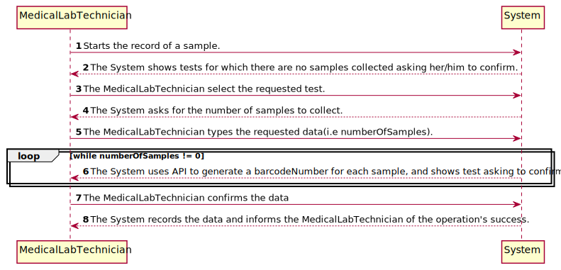
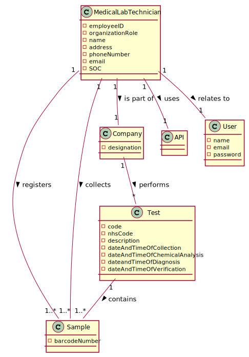
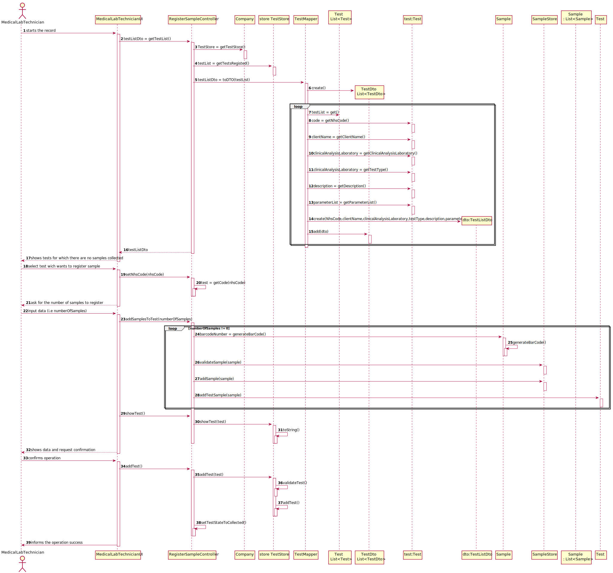
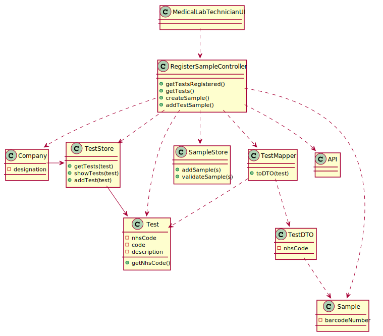

# US 005 - Record Samples

## 1. Requirements Engineering

*In this section, it is suggested to capture the requirement description and specifications as provided by the client as well as any further clarification on it. It is also suggested to capture the requirements acceptance criteria and existing dependencies to other requirements. At last, identfy the involved input and output data and depicted an Actor-System interaction in order to fulfill the requirement.*

### 1.1. User Story Description

*As a medical lab technician, I want to record the samples collected in the scope of a given test.*

### 1.2. Customer Specifications and Clarifications 

*Insert here any related specification and/or clarification provided by the client together with **your interpretation**. When possible, provide a link to such specifications/clarifications.*

**From the specifications document:**

- "When sampling (blood or swab) the medical lab technician records the samples in the system, 
associating the samples with the client/test, and identifying each sample with a barcode that is 
automatically generated using an external API."

**From the client clarifications:**

>- **Question:**  What kind of attributes should a sample have?
>- **Answer:** Each sample is associated with a test. A sample has only one attribute, a barcode number (UPC) that is a sequential number and is automatically generated by the system. Each sample has a unique barcode number. In US5, the medical lab technician checks the system and see all tests for which there are no samples collected. The medical lab technician selects a test and the system asks for the number of samples to collect.

 

>- **Question:** What is supposed to show to the Medical Lab Technician when he selects the pretended test ?
>- **Answer:** Firstly, the Medical Lab Technician checks the system to see the tests/clients that need to be done. Before selecting a test, the Medical Lab Technician checks/see the name of the client and all the test data (test attributes, test type, collection method, parameters, etc.). Then, the Medical Lab Technician selects one test/client and the system asks for the number of samples to collect. Next, the system generates the barcodes to put in the samples.

 

>- **Question:** It was answered in one of the previous questions that the sample only has one attribute, the barcode, however the description of the project also mentions a date of collection of the samples, is this date supposed to be an attribute of the test and not of the sample itself?
>- **Answer:** Yes. The system should record the date (DD/MM/YYYY) and time (HH:MM) when the sample is collect made. The date and time are automatically generated by the system when the barcode is issued.

 

>- **Question:** If there were multiple samples for a single test, would there be only one collection date for all of them?
>- **Answer:** Only one collection date and time for a test.

 

>- **Question:** What kind of attributes should a sample have?
>- **Answer:** Each sample is associated with a test. A sample has only one attribute, a barcode number (UPC) that is a sequential number and is automatically generated by the system. Each sample has a unique barcode number.

 

>- **Question:** During the current sprint, how should we allow the barcodes to be printed. After generating them via the API, should we save the barcode images to the disk?
>- **Answer:**Each generated barcode should be saved in a folder as a jpeg file.

 

>- **Question:** Can a test have more than one sample?
>- **Answer:** Yes.

 

### 1.3. Acceptance Criteria

AC1: The system should support several barcode APIs. The API to use is defined by configuration.
AC2: Medical lab technician need to be logged in to record the sample collected in the scope fo a given test.
AC3: The Medical Lab Technician must be able to register more than one sample in the scope of test.

### 1.4. Found out Dependencies

**US3:** Client must be registered.
**US4:** Need some test to add sample.
**US7:** Medical Lab Technician must be a registered employee.

### 1.5 Input and Output Data

**Input Data:**

* **Typed data:**
	*Number Of Samples
* **Selected data:**
	*Test
**Output Data:**
-* (In)Success of the operation

### 1.6. System Sequence Diagram (SSD)

*Insert here a SSD depicting the envisioned Actor-System interactions and throughout which data is inputted and outputted to fulfill the requirement. All interactions must be numbered.*

### 1.7 Other Relevant Remarks

*Use this section to capture other relevant information that is related with this US such as (i) special requirements ; (ii) data and/or technology variations; (iii) how often this US is held.* 

## 2. OO Analysis

### 2.1. Relevant Domain Model Excerpt 
*In this section, it is suggested to present an excerpt of the domain model that is seen as relevant to fulfill this requirement.* 

### 2.2. Other Remarks

*Use this section to capture some aditional notes/remarks that must be taken into consideration into the design activity. In some case, it might be usefull to add other analysis artifacts (e.g. activity or state diagrams).* 

## 3. Design - User Story Realization 

### 3.1. Rationale

**The rationale grounds on the SSD interactions and the identified input/output data.**

| Interaction ID | Question: Which class is responsible for... | Answer  | Justification (with patterns)  |
|:-------------  |:--------------------- |:------------|:---------------------------- |
| Step 1:...interacting with the actor?| MedicalLabTechnicianUI | **IE:** Responsible for user interaction |... coordinating the US? | RegisterSampleController | **Controller**  
| Step 2:...getting the list of tests? | TestStore | **Creator (R1)** and **HC+LC (Pure Fabrication)**: By the application of the Creator (R1) it would be the "Company". But, by applying HC + LC to the "Company", this delegates that responsibility to the "TestStore" | ...knowing the TestStore? | Company | **IE:** Company knows the TestStore to which it is delegating some tasks. |
| Step 3:...providing a list of Test to the UI? | TestListDTO | **DTO:** When there is there is a need to provide a list of objects to choose, it is better to opt by using a DTO in order to reduce coupling between UI and domain |...converting the list of test types to a list of DTOs | TestMapper | **DTO** | 
| Step 4:...getting the selected Test? | RegisterSampleController | ...uses the NhsCode to get the specific test |
| Step 5:...save the sample on Test? | Test | Object has your own data | ...save sample in store? | SampleStore | ...validates sample? | SampleStore |...generate a barcodeNumber? | API |
| Step 6:...shows the test to UI? | RegisterSampleController |
| Step 7:...validating data? | TestStore | **IE:** knows all the tests |... saving the test? | TestStore | **IE:** Knows all the tests |... changing the State of the test? | RegisterSampleController | 
| Step 9:...informing operations success?	 |  MedicalLabTechnicianUI  |  **IE:** Responsible for user interaction  |    

### Systematization ##

According to the taken rationale, the conceptual classes promoted to software classes are: 

 * Company
 * Test
 * Sample
 * MedicalLabTechnician

Other software classes (i.e. Pure Fabrication) identified: 
 * RegisterSampleController
 * MedicalLabTechnicianUI
 * TestStore
 * SampleStore
 * TestMapper
 * TestDTO

## 3.2. Sequence Diagram (SD)

*In this section, it is suggested to present an UML dynamic view stating the sequence of domain related software objects' interactions that allows to fulfill the requirement.* 

## 3.3. Class Diagram (CD)

*In this section, it is suggested to present an UML static view representing the main domain related software classes that are involved in fulfilling the requirement as well as and their relations, attributes and methods.*

# 4. Tests 

## 4.1 Sample Model Class

**Test 1:** Check the barcodeNumber length.
**Test 2:** check get the barcodeNumber.
**Test 3:** check set the barcodeNumber.
**Test 4:** check if generate barcodeNumber.
**Test 4:** check if create UPCA.

## 4.2 Medical Lab Technician Model Class

**Test 1:** Check get Medical Lab Technician Index Number.
**Test 2:** Check if doctor index number is valid.
**Test 3:** Check if employee is valid.
**Test 4:** Check set doctor index number.

## 4.3 Sample Store Class

**Test 1:** Check add samples.
**Test 2:** Check validate sample.

## 4.4 Register Sample Controller Class

**Test 1:** Check get Tests Registed.
**Test 2:** Check add sample to test.
**Test 3:** Check set Test State to Collected

## 4.5 Test Store Class

**Test 1:** Check validate Test
**Test 2:** Check get Tests
**Test 3:** Check get Tests with nhsCode

## 4.6 Test Class

**Test 1:** Check get nhsCode.
**Test 2:** Check get description.
**Test 3:** Check get current state.
**Test 4:** Check get Test Type.
**Test 6:** Check get Test Samples.
**Test 7:** Check equals.

# 5. Construction (Implementation)

*In this section, it is suggested to provide, if necessary, some evidence that the construction/implementation is in accordance with the previously carried out design. Furthermore, it is recommeded to mention/describe the existence of other relevant (e.g. configuration) files and highlight relevant commits.*

*It is also recommended to organize this content by subsections.* 

## 5.1 MedicalLabTechnicianUI

This class is responisble for the input and output of data, It begins by creating an instance of the RegisterSampleController, which will be responsible for the interaction with the domain layer. Then, it shows a list of test(DTO) for the Medical Lab Technician to choose one, after that UI send the information to RegisterSampleController for wich test will be used to added samples. Then UI ask MLT how many samples he want to register. When the samples are all saved in the test the UI shows the complete test to MLT asking for confirmation, if its all ok, the UI informs MLT the operation success.

## 5.2 Test Class

This class holds all the necessary attributes for the tests (i.e., an internal code, an NHS code, a description describing the collection method, relevant dates) and also contains objects necessary to all features relating to the tests.

## 5.3 Sample Class

The Sample class holds all necessary attributes for Sample(i.e., a barcodeNumber) and methods of the interface CreateBarcode that generates an UPCA barcode. 

## 5.4 RegisterSampleController Class

This class uses the app singleton to get the company and the necessary stores(TestStore,SampleStore).
In this class there are the methods responsible for generate a barcodeNumber with the information for each sample, add samples to the test, change the state of the test(COLLECTED), check that the sample was correctly added to the test. To get the lists requested by the UI, Controller goes to TestStore to get list of tests and than using Mappers to be converted into lists of DTOs. To add all the selected samples to a list that will then be sent to the SampleStore at the time of it's creation.

## 5.5 SampleStore Class

This class is responsible for adding samples to the store and validations.

## 5.6 TestStore Class

Although the Company class is the one that should know the Tests it performs, it delegates its storage to the TestStore by Pure Fabrication, to reduce its complexity.

## 5.7 DTO and Mappers

These classes were made to give lists of objects to the UI layer. By using DTOs, there is a reduced coupling between the domain layer and the UI layer, by only sending the informations that are essential to present.
For example, the TestDto class only has its nhsCode. The UI can access and present this info, but not change anything on the domain object, nor use its methods.

# 6. Integration and Demo 

*In this section, it is suggested to describe the efforts made to integrate this functionality with the other features of the system.*

* A SampleStore was created to make it more practical in another US.

# 7. Observations

*In this section, it is suggested to present a critical perspective on the developed work, pointing, for example, to other alternatives and or future related work.*