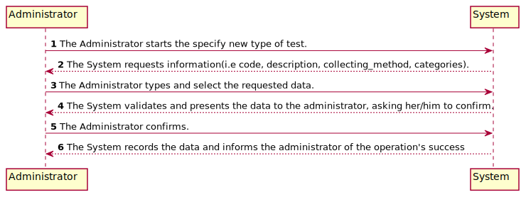
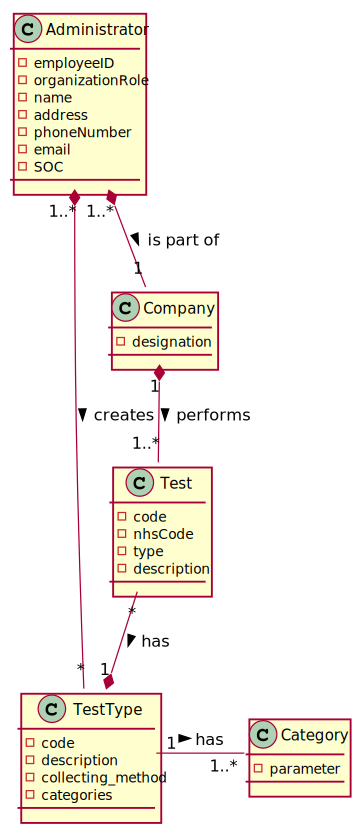
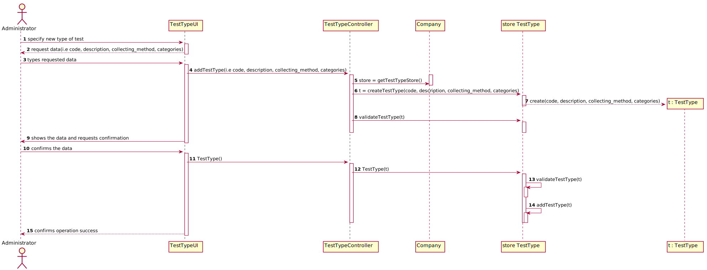
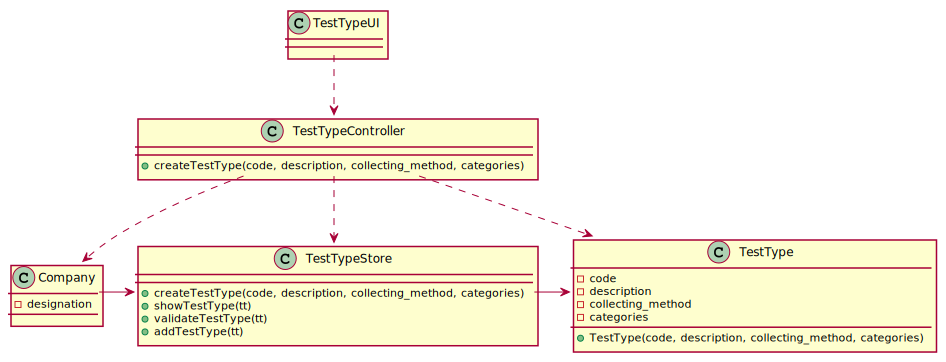

# US 009 - Specify New Type of Test

## 1. Requirements Engineering

*In this section, it is suggested to capture the requirement description and specifications as provided by the client as well as any further clarification on it. It is also suggested to capture the requirements acceptance criteria and existing dependencies to other requirements. At last, identfy the involved input and output data and depicted an Actor-System interaction in order to fulfill the requirement.*

### 1.1. User Story Description

*As an administrator, I want to specify a new type of test and its collecting methods.*

### 1.2. Customer Specifications and Clarifications

*Insert here any related specification and/or clarification provided by the client together with **your interpretation**. When possible, provide a link to such specifications/clarifications.*

There exists only one collection method per test type.

Q: Are the collecting methods stored simpled as a word or a sentence, or does it also must contain it's description, and/or another attributes?
A: "To make a Covid test you need a swab to collect a sample. To make a blood test you need sample tubes and a syringe.
When the administrator (US9) specifies a new type of test, the administrator also specifies the method to collect a sample. The administrator introduces a brief description for specifying the collecting method. "

### 1.3. Acceptance Criteria

*Insert here the client acceptance criteria.*

* AC1: collecting method is associated with a test type. Whenever a test type is created a collecting method should be defined.*

* AC2: Description cannot be empty.

The new type of test rely on measuring one or more parameters that can be grouped/organized by categories.

### 1.4. Found out Dependencies

*Identify here any found out dependency to other US and/or requirements.*

* User Story - 11
* User Story - 10
* To use this US it is necessary to run US10 and US11 if we dont have the category or parameters needed to create the new type of test.

### 1.5 Input and Output Data

*Identity here the data to be inputted by the system actor as well as the output data that the system have/needs to present in order to properly support the actor actions. Regarding the inputted data, it is suggested to distinguish between typed data and selected data (e.g. from a list)*

1. The Administrator starts the specify new type of test.
2. The System requests information(i.e code, description, collecting_method, categories).
3. The Administrator types and select the requested data.
4. The System validates and presents the data to the administrator, asking her/him to confirm.
5. The Administrator confirms.
6. The System records the data and informs the administrator of the operation's success.

### 1.6. System Sequence Diagram (SSD)

*Insert here a SSD depicting the envisioned Actor-System interactions and throughout which data is inputted and outputted to fulfill the requirement. All interactions must be numbered.*

### 1.7 Other Relevant Remarks

*Use this section to capture other relevant information that is related with this US such as (i) special requirements ; (ii) data and/or technology variations; (iii) how often this US is held.*

## 2. OO Analysis

### 2.1. Relevant Domain Model Excerpt
*In this section, it is suggested to present an excerpt of the domain model that is seen as relevant to fulfill this requirement.*

### 2.2. Other Remarks

*Use this section to capture some aditional notes/remarks that must be taken into consideration into the design activity. In some case, it might be usefull to add other analysis artifacts (e.g. activity or state diagrams).*

## 3. Design - User Story Realization

### 3.1. Rationale

**The rationale grounds on the SSD interactions and the identified input/output data.**

| Interaction ID | Question: Which class is responsible for... | Answer  | Justification (with patterns)  |
|:-------------  |:--------------------- |:------------|:---------------------------- |
| Step 1: specify a new type of test  		 |...instantiating a new type of test? | Administrator|Creator: R1/2 (?) |
| Step 2: requests information(i.e code, description, collecting_method, categories) |...n/a							 |             |                              |
| Step 3: types requested data  		 |...saving the input data?	 |TestType   |I.E the object created in step 1 has its own data |
| Step 4: validate and shows the data and requests confirmation |...validate that the data? | Company | I.E was entered correctly, with no duplicates or blanks | knows all the data|
| Step 5: confirms the data |...saving the created type of test?|Company| records all Type of teste objects|
| Step 6: informs operation success |...informing operations success?|UI|IE: Responsible for user interaction |         

### Systematization ##

According to the taken rationale, the conceptual classes promoted to software classes are:

 * Company
 * TestType
 * Administrator

Other software classes (i.e. Pure Fabrication) identified:
 * TestTypeUI  
 * TestTypeController
 * TestTypeStore

## 3.2. Sequence Diagram (SD)

*In this section, it is suggested to present an UML dynamic view stating the sequence of domain related software objects' interactions that allows to fulfill the requirement.*

## 3.3. Class Diagram (CD)

*In this section, it is suggested to present an UML static view representing the main domain related software classes that are involved in fulfilling the requirement as well as and their relations, attributes and methods.*

# 4. Tests
*In this section, it is suggested to systematize how the tests were designed to allow a correct measurement of requirements fulfilling.*

- TestType

**Test 1:** Validate the description to cannot be null and has no more than 15 characters"

**Test 2:** Validate the collecting method to cannot be null and has no more than 20 characters"

**Test 3:** Check that the equals method was working as intended.

**Test 4:** Valide if code have only numbers

**Test 5:** Check that the get method was working as intended.
  
- TestType Store

**Test 1:** Add a TestType

**Test 2:** Validates data from the TestType

**Test 3:** Show the TestType

# 5. Construction (Implementation)

*In this section, it is suggested to provide, if necessary, some evidence that the construction/implementation is in accordance with the previously carried out design. Furthermore, it is recommeded to mention/describe the existence of other relevant (e.g. configuration) files and highlight relevant commits.*

*It is also recommended to organize this content by subsections.*

## 5.1 TestType
This class holds the necessary attributes for the TestType (i.e code, description, collecting_method, categories). In case some of the attributes is invalid (either when creating the instance or modifying it), the validation method will throw an exception that will be handled in the TestTypeController.

## 5.2 TestTypeUI
This class is responsible for the input and output of data for the TestType. 
It begins with trying to create an instance of the TestTypeController, which will only be successful if the person trying to access it is logged in with the appropriate role (Administrator). Then system asks the administrator for all the necessary data. In case the TestType is successfully created (i.e. none of the validity exceptions was thrown, nor the Test Types is a duplicate of an already existing one), it shows the administrator all the information for confirmation. Once confirmed, it outputs the success of the operation

## 5.1 TestTypeController
This class uses the app singleton to get the company and then the associated TestType store, to then act upon it, by creating and adding TestType. The create() method is responsible for this instantiation and also for checking if the user is logged in with the Administrator role.

# 6. Integration and Demo

*In this section, it is suggested to describe the efforts made to integrate this functionality with the other features of the system.*

# 7. Observations

*In this section, it is suggested to present a critical perspective on the developed work, pointing, for example, to other alternatives and or future related work.*

